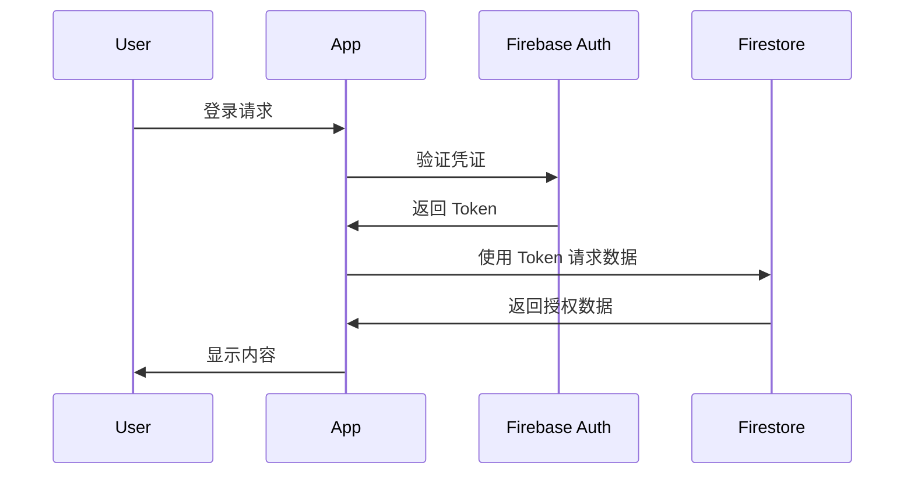

# 📐 项目架构设计

ML Platform 采用现代化的 Flutter + Firebase 架构,实现跨平台、高性能的可视化学习体验。

## 🏗️ 整体架构

### 三层架构设计

```text
┌─────────────────────────────────────────────────┐
│                  表现层 (UI Layer)               │
│  Flutter Widgets + Material Design 3            │
│  - Screens (页面)                               │
│  - Widgets (组件)                               │
│  - Animations (动画)                            │
└──────────────────┬──────────────────────────────┘
                   │
┌──────────────────▼──────────────────────────────┐
│               业务逻辑层 (BLoC Layer)            │
│  State Management + Business Logic              │
│  - Providers (状态管理)                         │
│  - Services (服务)                              │
│  - Models (数据模型)                            │
└──────────────────┬──────────────────────────────┘
                   │
┌──────────────────▼──────────────────────────────┐
│               数据层 (Data Layer)                │
│  Firebase + Cloud Functions                     │
│  - Firestore (数据库)                           │
│  - Authentication (认证)                        │
│  - Cloud Functions (后端逻辑)                   │
└─────────────────────────────────────────────────┘
```

## 📁 目录结构

```
ml_platform/
├── lib/
│   ├── main.dart                  # 应用入口
│   ├── config/                    # 配置文件
│   │   ├── app_router.dart       # 路由配置
│   │   └── app_theme.dart        # 主题配置
│   ├── models/                    # 数据模型
│   │   ├── algorithm_model.dart
│   │   ├── data_structure_model.dart
│   │   └── learning_stats.dart
│   ├── screens/                   # 页面
│   │   ├── home/                 # 主页
│   │   ├── algorithm/            # 算法可视化
│   │   ├── os/                   # 操作系统模拟
│   │   └── ml/                   # 机器学习
│   ├── widgets/                   # 可复用组件
│   │   ├── common/               # 通用组件
│   │   └── visualization/        # 可视化组件
│   ├── services/                  # 业务服务
│   │   ├── auth_service.dart     # 认证服务
│   │   ├── firestore_service.dart # 数据库服务
│   │   └── analytics_service.dart # 分析服务
│   └── utils/                     # 工具类
│       ├── constants.dart
│       └── helpers.dart
├── functions/                     # Cloud Functions
│   ├── main.py                   # Python 后端
│   └── requirements.txt
├── test/                          # 测试文件
└── docs/                          # 文档

```

## 🎯 核心模块详解

### 1. 算法可视化模块

**功能**: 提供20+种经典算法的动画演示

**技术栈**:
- `CustomPainter` - 自定义绘制
- `AnimationController` - 动画控制
- `Canvas API` - 图形渲染

**关键类**:
```dart
// 算法可视化基类
abstract class AlgorithmVisualizer {
  void init();
  void step();
  void reset();
  void draw(Canvas canvas, Size size);
}

// 排序算法实现
class BubbleSortVisualizer extends AlgorithmVisualizer {
  List<int> array;
  int currentIndex;
  // ... 实现细节
}
```

**数据流**:
```
用户操作 → 更新状态 → 触发动画 → 渲染Canvas → 显示结果
```

### 2. 操作系统模拟器模块

**功能**: 模拟进程调度、内存管理、死锁检测

**技术栈**:
- `Isolate` - 模拟并发
- `Stream` - 事件流处理
- `Timer` - 时间片模拟

**关键组件**:
```dart
// 进程控制块
class ProcessControlBlock {
  int pid;
  ProcessState state;
  int priority;
  int arrivalTime;
  int burstTime;
}

// 调度器
class Scheduler {
  SchedulingAlgorithm algorithm;
  Queue<PCB> readyQueue;
  
  void schedule();
  void dispatch(PCB process);
}
```

### 3. 机器学习平台模块

**功能**: 提供模型训练、数据可视化

**技术架构**:
```
Flutter 前端 ←→ Cloud Functions (Python) ←→ Firebase ML
```

**数据处理流程**:
1. 用户上传数据 → Firestore Storage
2. 触发 Cloud Function
3. Python 后端处理训练
4. 返回结果可视化
5. 保存模型到 Firebase ML

## 🔄 数据流架构

### Provider 状态管理

使用 Provider 模式管理应用状态:

```dart
// 全局状态
class AppState extends ChangeNotifier {
  User? currentUser;
  ThemeMode themeMode;
  
  void updateTheme(ThemeMode mode) {
    themeMode = mode;
    notifyListeners();
  }
}

// 在 Widget 中使用
class MyWidget extends StatelessWidget {
  @override
  Widget build(BuildContext context) {
    return Consumer<AppState>(
      builder: (context, appState, child) {
        return Text('Current theme: ${appState.themeMode}');
      },
    );
  }
}
```

### Firebase 数据流

```
Firestore Collection 结构:
├── users/                          # 用户数据
│   └── {userId}/
│       ├── profile                # 个人资料
│       ├── progress               # 学习进度
│       └── achievements           # 成就记录
├── algorithms/                     # 算法数据
│   └── {algorithmId}/
│       ├── metadata               # 元数据
│       └── examples               # 示例
└── sessions/                       # 学习会话
    └── {sessionId}/
        ├── timestamp
        └── activity_log
```

## 🔐 安全架构

### 认证流程



### Firestore 安全规则

```javascript
rules_version = '2';
service cloud.firestore {
  match /databases/{database}/documents {
    // 用户只能读写自己的数据
    match /users/{userId} {
      allow read, write: if request.auth != null 
                         && request.auth.uid == userId;
    }
    
    // 所有人可读算法数据
    match /algorithms/{algorithmId} {
      allow read: if true;
      allow write: if request.auth != null 
                   && get(/databases/$(database)/documents/users/$(request.auth.uid)).data.role == 'admin';
    }
  }
}
```

## 🚀 性能优化策略

### 1. 懒加载

```dart
// 路由懒加载
class AppRouter {
  static final routes = {
    '/': (context) => HomePage(),
    '/algorithm': (context) => AlgorithmPage(),
    // 按需加载重页面
    '/ml': (context) => FutureBuilder(
      future: _loadMLModule(),
      builder: (context, snapshot) {
        if (snapshot.hasData) {
          return snapshot.data as Widget;
        }
        return LoadingScreen();
      },
    ),
  };
}
```

### 2. 缓存策略

```dart
// Firebase 离线缓存
FirebaseFirestore.instance.settings = Settings(
  persistenceEnabled: true,
  cacheSizeBytes: Settings.CACHE_SIZE_UNLIMITED,
);

// 图片缓存
CachedNetworkImage(
  imageUrl: url,
  cacheManager: CustomCacheManager(),
);
```

### 3. 代码分割

```dart
// 使用 deferred loading
import 'package:ml_platform/ml/ml_module.dart' deferred as ml;

void loadMLModule() async {
  await ml.loadLibrary();
  ml.initMLModule();
}
```

## 📱 跨平台适配

### 响应式布局

```dart
class ResponsiveLayout extends StatelessWidget {
  final Widget mobile;
  final Widget tablet;
  final Widget desktop;
  
  @override
  Widget build(BuildContext context) {
    return LayoutBuilder(
      builder: (context, constraints) {
        if (constraints.maxWidth < 600) {
          return mobile;
        } else if (constraints.maxWidth < 1200) {
          return tablet;
        } else {
          return desktop;
        }
      },
    );
  }
}
```

### 平台特定代码

```dart
import 'dart:io' show Platform;

Widget getPlatformSpecificWidget() {
  if (Platform.isAndroid) {
    return AndroidWidget();
  } else if (Platform.isIOS) {
    return IOSWidget();
  } else if (Platform.isWindows) {
    return WindowsWidget();
  } else {
    return WebWidget();
  }
}
```

## 🧪 测试架构

### 测试金字塔

```
        /\
       /  \      E2E Tests (少量)
      /____\     
     /      \    Integration Tests (适量)
    /________\   
   /          \  Unit Tests (大量)
  /__________  \
```

### 测试示例

```dart
// 单元测试
void main() {
  group('BubbleSort', () {
    test('should sort array correctly', () {
      final sorter = BubbleSort();
      final result = sorter.sort([3, 1, 4, 1, 5]);
      expect(result, [1, 1, 3, 4, 5]);
    });
  });
}

// Widget 测试
void main() {
  testWidgets('HomePage displays correctly', (tester) async {
    await tester.pumpWidget(MyApp());
    expect(find.text('ML Platform'), findsOneWidget);
    expect(find.byType(NavigationBar), findsOneWidget);
  });
}
```

## 📊 监控与分析

### Firebase Analytics

```dart
// 记录用户行为
FirebaseAnalytics.instance.logEvent(
  name: 'algorithm_started',
  parameters: {
    'algorithm_type': 'bubble_sort',
    'difficulty': 'easy',
  },
);

// 记录屏幕浏览
FirebaseAnalytics.instance.setCurrentScreen(
  screenName: 'AlgorithmPage',
);
```

### 性能监控

```dart
// Performance Monitoring
final HttpMetric metric = FirebasePerformance.instance
    .newHttpMetric('https://api.example.com/data', HttpMethod.Get);

await metric.start();
final response = await http.get(url);
metric.responseCode = response.statusCode;
await metric.stop();
```

## 🔄 CI/CD 流程

```yaml
# GitHub Actions 工作流
name: Build and Deploy

on:
  push:
    branches: [ main ]

jobs:
  build:
    runs-on: ubuntu-latest
    steps:
      - uses: actions/checkout@v2
      - uses: subosito/flutter-action@v2
      - run: flutter test
      - run: flutter build web
      - uses: FirebaseExtended/action-hosting-deploy@v0
```

## 📚 技术栈总览

| 层级 | 技术 | 用途 |
|------|------|------|
| 前端框架 | Flutter 3.10+ | 跨平台UI |
| 状态管理 | Provider | 状态管理 |
| 后端服务 | Firebase | BaaS |
| 数据库 | Firestore | NoSQL 数据库 |
| 认证 | Firebase Auth | 用户认证 |
| 存储 | Firebase Storage | 文件存储 |
| 云函数 | Cloud Functions | 后端逻辑 |
| ML后端 | Python + TensorFlow | 机器学习 |
| 分析 | Firebase Analytics | 数据分析 |
| 监控 | Firebase Performance | 性能监控 |
| CI/CD | GitHub Actions | 自动化部署 |

## 🎯 架构优势

1. **跨平台**: 一套代码运行在 Web、Android、iOS、Windows
2. **高性能**: Flutter 的高性能渲染引擎
3. **可扩展**: 模块化设计,易于添加新功能
4. **实时同步**: Firebase 实时数据库
5. **无服务器**: Firebase BaaS 减少运维成本
6. **安全可靠**: Firebase 内置安全规则

## 📖 相关文档

- [开发指南](./contributing.md)
- [代码规范](./code-style.md)
- [API文档](../api/)

---

*本架构文档持续更新中,如有疑问请提交 Issue*
