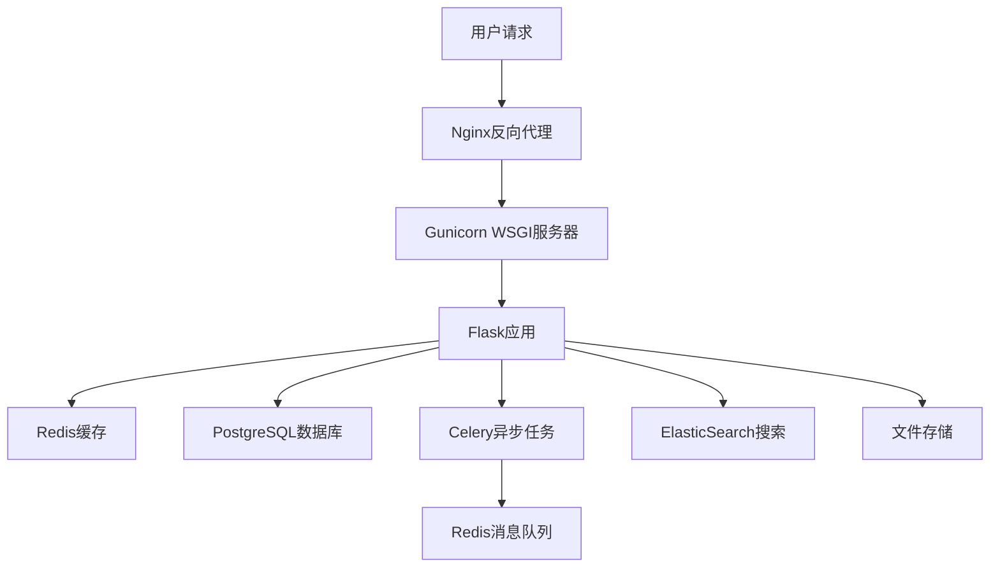

# Flask 企业级Web应用

一个功能完整的现代化Flask Web应用程序，展示了企业级Web开发的最佳实践，集成了完整的用户系统、博客管理、RESTful API、缓存优化、搜索功能等现代Web应用所需的全部功能。

## 🚀 核心功能特性

### 🔐 完整用户认证体系

- **用户注册登录** - 支持邮箱/用户名多种登录方式
- **密码安全** - 密码哈希加密，支持重置功能
- **用户资料** - 个人信息管理、头像上传
- **邮箱验证** - 可选的邮箱验证机制
- **角色权限** - 用户角色管理（管理员/普通用户）

### 📝 现代博客管理系统

- **富文本编辑** - 支持Markdown和可视化编辑器
- **文章管理** - 发布、编辑、草稿、定时发布
- **分类标签** - 灵活的分类和标签系统
- **评论互动** - 多层评论、点赞、审核机制
- **全文搜索** - 基于ElasticSearch的高性能搜索
- **SEO优化** - 自动生成sitemap、meta标签

### 🔧 强大管理后台

- **仪表盘统计** - 用户、文章、访问量等数据可视化
- **用户管理** - 用户列表、权限分配、状态管理
- **内容管理** - 文章审核、批量操作、内容推荐
- **评论审核** - 评论管理、垃圾评论过滤
- **系统配置** - 网站设置、缓存管理、备份功能

### 🚀 企业级RESTful API

- **JWT认证** - 无状态身份认证，支持刷新令牌
- **版本控制** - API版本管理（v1, v2）
- **限流保护** - API访问频率限制
- **文档自动生成** - Swagger/OpenAPI文档
- **数据验证** - 请求参数严格验证
- **错误处理** - 统一的错误响应格式

### 🎨 现代化前端界面

- **响应式设计** - 支持桌面、平板、手机多端适配
- **Bootstrap 5** - 现代CSS框架
- **AJAX交互** - 无刷新页面操作
- **主题切换** - 明暗主题支持
- **PWA支持** - 渐进式Web应用特性

### ⚡ 性能优化功能

- **Redis缓存** - 多级缓存策略
- **数据库优化** - 查询优化、索引管理
- **CDN集成** - 静态资源加速
- **图片处理** - 自动压缩、格式转换
- **Celery异步任务** - 邮件发送、数据处理

### 🛡️ 安全防护机制

- **CSRF保护** - 跨站请求伪造防护
- **XSS防护** - 跨站脚本攻击防护
- **SQL注入防护** - ORM安全查询
- **文件上传安全** - 文件类型验证、病毒扫描
- **访问日志** - 详细的访问和操作日志

## 🏗️ 项目架构

### 技术架构图



### 项目目录结构

```bash
flask-app/
├── app/                         # 📁 核心应用包
│   ├── __init__.py             # 🏭 应用工厂模式入口
│   ├── models.py               # 📊 SQLAlchemy数据模型
│   ├── cache_service.py        # 🚀 Redis缓存服务
│   ├── search_service.py       # 🔍 ElasticSearch搜索服务
│   ├── tasks.py                # ⚡ Celery异步任务定义
│   ├── main/                   # 🏠 主页面蓝图
│   │   ├── __init__.py
│   │   └── routes.py           # 首页、关于页路由
│   ├── auth/                   # 🔐 用户认证蓝图
│   │   ├── __init__.py
│   │   ├── routes.py           # 登录、注册、密码重置
│   │   ├── forms.py            # WTF表单定义
│   │   └── email.py            # 邮件发送功能
│   ├── blog/                   # 📝 博客功能蓝图
│   │   ├── __init__.py
│   │   ├── routes.py           # 文章CRUD、评论管理
│   │   └── forms.py            # 文章、评论表单
│   ├── admin/                  # 🔧 管理后台蓝图
│   │   ├── __init__.py
│   │   ├── routes.py           # 后台管理功能
│   │   ├── forms.py            # 管理表单
│   │   └── utils.py            # 管理工具函数
│   ├── api/                    # 🚀 RESTful API蓝图
│   │   ├── __init__.py
│   │   ├── routes.py           # API路由定义
│   │   └── auth.py             # JWT认证装饰器
│   ├── media/                  # 🖼️ 媒体文件处理
│   │   ├── __init__.py
│   │   ├── routes.py           # 文件上传下载
│   │   ├── forms.py            # 上传表单
│   │   └── utils.py            # 图片处理工具
│   ├── errors/                 # ❌ 错误处理蓝图
│   │   ├── __init__.py
│   │   └── handlers.py         # 404、500等错误页面
│   ├── templates/              # 🎨 Jinja2模板文件
│   │   ├── base.html           # 基础模板
│   │   ├── main/               # 主页模板
│   │   ├── auth/               # 认证页面模板
│   │   ├── blog/               # 博客页面模板
│   │   ├── admin/              # 管理后台模板
│   │   └── errors/             # 错误页面模板
│   └── static/                 # 🎯 静态资源文件
│       ├── css/                # 样式文件
│       ├── js/                 # JavaScript文件
│       ├── img/                # 图片资源
│       └── uploads/            # 用户上传文件
├── migrations/                  # 📈 数据库迁移文件
├── tests/                      # 🧪 测试代码
│   ├── test_models.py          # 模型测试
│   ├── test_auth.py            # 认证测试
│   └── test_api.py             # API测试
├── logs/                       # 📝 应用日志文件
├── docs/                       # 📚 项目文档
├── instance/                   # 🔒 实例配置（不纳入版本控制）
├── config.py                   # ⚙️ 应用配置文件
├── requirements.txt            # 📦 Python依赖包列表
├── run.py                      # 🚀 开发环境启动脚本
├── start.py                    # 🏭 生产环境启动脚本
├── manage.py                   # 🛠️ 管理命令脚本
├── celery_worker.py            # ⚡ Celery工作进程启动
├── cache_monitor.py            # 📊 缓存监控脚本
├── Dockerfile                  # 🐳 Docker镜像构建
├── docker-compose.yml          # 🐳 Docker Compose编排
├── .env                        # 🔐 环境变量配置
└── 启动指南.md                 # 📖 中文启动指南
```

## 安装和运行

### 前提条件
- Python 3.8+
- pip
- Git

### 1. 克隆项目
```bash
git clone <repository-url>
cd flask-app
```

### 2. 创建虚拟环境
```bash
python -m venv venv
# Windows
venv\Scripts\activate
# macOS/Linux
source venv/bin/activate
```

### 3. 安装依赖
```bash
pip install -r requirements.txt
```

### 4. 配置环境变量
复制 `.env.example` 到 `.env` 并配置相应的环境变量：
```bash
cp .env.example .env
```

### 5. 初始化数据库
```bash
flask db init
flask db migrate -m "Initial migration"
flask db upgrade
```

### 6. 创建管理员用户
```bash
flask create-admin
```

### 7. 运行应用
```bash
python run.py
```

访问 http://localhost:5000

## Docker部署

### 使用Docker Compose
```bash
docker-compose up -d
```

### 单独构建Docker镜像
```bash
docker build -t flask-app .
docker run -p 5000:5000 flask-app
```

## API文档

### 认证接口

#### 登录
```
POST /api/v1/auth/login
Content-Type: application/json

{
    "username": "your_username",
    "password": "your_password"
}
```

#### 注册
```
POST /api/v1/auth/register
Content-Type: application/json

{
    "username": "new_username",
    "email": "email@example.com",
    "password": "password"
}
```

### 文章接口

#### 获取文章列表
```
GET /api/v1/posts?page=1&per_page=10
```

#### 获取单篇文章
```
GET /api/v1/posts/{id}
```

#### 创建文章
```
POST /api/v1/posts
Authorization: Bearer {access_token}
Content-Type: application/json

{
    "title": "文章标题",
    "content": "文章内容",
    "summary": "文章摘要",
    "published": true
}
```

## 测试

运行所有测试：
```bash
flask test
```

运行特定测试：
```bash
python -m pytest tests/test_models.py
```

## 贡献指南

1. Fork 项目
2. 创建功能分支 (`git checkout -b feature/AmazingFeature`)
3. 提交更改 (`git commit -m 'Add some AmazingFeature'`)
4. 推送到分支 (`git push origin feature/AmazingFeature`)
5. 开启 Pull Request

## 技术栈

### 后端
- **Flask** - Web框架
- **SQLAlchemy** - ORM
- **Flask-Login** - 用户会话管理
- **Flask-JWT-Extended** - JWT认证
- **Flask-Mail** - 邮件发送
- **Flask-WTF** - 表单处理
- **Flask-Migrate** - 数据库迁移

### 前端
- **Bootstrap 5** - CSS框架
- **Font Awesome** - 图标库
- **JavaScript (ES6+)** - 前端交互

### 数据库
- **SQLite** (开发环境)
- **PostgreSQL** (生产环境)
- **Redis** (缓存和会话)

### 部署
- **Docker** - 容器化
- **Nginx** - Web服务器
- **Gunicorn** - WSGI服务器

## 许可证

MIT License - 查看 [LICENSE](LICENSE) 文件了解详情

## 联系方式

如有问题或建议，请创建 Issue 或联系项目维护者。
