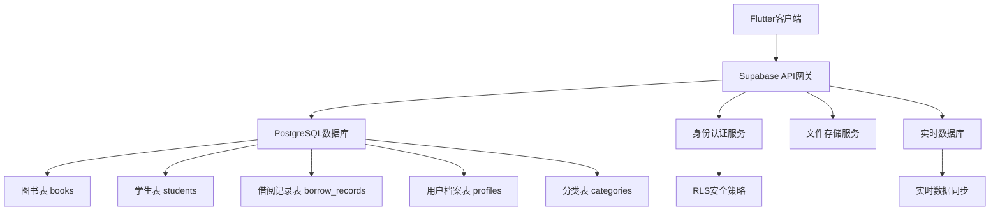

# 幼儿园图书馆管理系统

一个基于Flutter和Supabase构建的现代化幼儿园图书馆管理应用，支持图书管理、学生信息、借阅记录、角色权限等完整功能。

## 🚀 项目概述

本系统专为幼儿园环境设计，提供直观易用的图书馆管理解决方案，支持老师日常的图书借阅管理工作，包含完整的用户权限体系和数据统计分析功能。

### 核心功能特性

#### 📚 图书管理系统
- **图书档案管理** - 图书信息录入、编辑、删除
- **分类标签系统** - 灵活的图书分类管理
- **图书搜索** - 支持书名、作者、ISBN等多维度搜索
- **库存统计** - 实时图书数量和状态追踪
- **图片管理** - 支持图书封面上传和展示

#### 👥 学生信息管理
- **学生档案** - 完整的学生信息管理
- **班级管理** - 按班级组织学生信息
- **借阅历史** - 个人借阅记录跟踪
- **学生搜索** - 快速查找学生信息

#### 📖 借阅管理系统
- **多本借阅** - 支持一次借阅多本图书
- **智能还书** - 快速还书和状态更新
- **逾期管理** - 自动逾期检测和提醒
- **借阅统计** - 详细的借阅数据分析
- **历史记录** - 完整的借阅历史追踪

#### 🔐 角色权限管理
- **多角色支持** - 普通老师和超级管理员
- **权限隔离** - 基于角色的功能访问控制
- **安全认证** - Supabase身份认证集成
- **数据安全** - RLS行级安全策略

#### 📊 数据统计分析
- **仪表盘概览** - 关键指标实时显示
- **借阅趋势** - 图表化数据展示
- **热门图书** - 借阅排行统计
- **用户活跃度** - 师生活动分析

## 🏗️ 技术架构

### 技术栈

#### 前端框架
- **Flutter 3.9.0+** - 跨平台移动应用框架
- **Dart** - 现代化编程语言
- **Material Design 3** - Google设计语言

#### 后端服务
- **Supabase** - 开源Firebase替代方案
- **PostgreSQL** - 强大的关系型数据库
- **RLS安全策略** - 行级安全控制
- **实时订阅** - 数据实时同步

#### 核心依赖包
```yaml
dependencies:
  flutter: sdk
  supabase_flutter: ^2.5.8     # Supabase客户端
  image_picker: ^1.0.4         # 图片选择器
  cached_network_image: ^3.3.0 # 网络图片缓存
  intl: ^0.18.1               # 国际化和日期格式
  shimmer: ^3.0.0             # 加载动画效果
```

### 系统架构图



## 📁 项目结构

```
kindergarten_library/
├── lib/                        # 📱 Flutter应用源码
│   ├── main.dart              # 应用入口点
│   ├── models/                # 📊 数据模型层
│   │   ├── book.dart          # 图书数据模型
│   │   ├── student.dart       # 学生数据模型
│   │   ├── borrow_record.dart # 借阅记录模型
│   │   ├── profile.dart       # 用户档案模型
│   │   └── category.dart      # 分类数据模型
│   ├── services/              # 🔧 业务逻辑服务层
│   │   ├── auth_service.dart  # 认证服务
│   │   ├── book_service.dart  # 图书管理服务
│   │   ├── student_service.dart # 学生管理服务
│   │   ├── borrow_service.dart # 借阅管理服务
│   │   ├── category_service.dart # 分类管理服务
│   │   └── dashboard_service.dart # 仪表盘数据服务
│   ├── screens/               # 🖥️ 用户界面屏幕
│   │   ├── auth_gate.dart     # 认证路由守卫
│   │   ├── login_screen.dart  # 登录页面
│   │   ├── register_screen.dart # 注册页面
│   │   ├── main_navigation.dart # 主导航框架
│   │   ├── dashboard_screen.dart # 数据仪表盘
│   │   ├── home_screen.dart   # 图书列表主页
│   │   ├── book_detail_screen.dart # 图书详情页
│   │   ├── add_edit_book_screen.dart # 图书编辑页
│   │   ├── student_list_screen.dart # 学生列表页
│   │   ├── student_detail_screen.dart # 学生详情页
│   │   ├── borrow_book_screen.dart # 借书页面
│   │   ├── return_book_screen.dart # 还书页面
│   │   ├── overdue_records_screen.dart # 逾期记录页
│   │   ├── profile_screen.dart # 个人中心
│   │   └── category_management_screen.dart # 分类管理
│   └── utils/                 # 🛠️ 工具类
│       └── page_transitions.dart # 页面转场动画
├── android/                   # 🤖 Android平台配置
├── ios/                       # 🍎 iOS平台配置
├── web/                       # 🌐 Web平台配置
├── pubspec.yaml              # 📦 项目依赖配置
├── .firebaserc               # Firebase项目配置
└── analysis_options.yaml    # Dart代码分析配置
```

## 🗄️ 数据库设计

### 核心数据表结构

#### 1. 用户档案表 (profiles)
```sql
CREATE TABLE profiles (
    id UUID PRIMARY KEY REFERENCES auth.users(id),
    full_name TEXT NOT NULL,
    role TEXT DEFAULT 'teacher' CHECK (role IN ('teacher', 'admin')),
    created_at TIMESTAMP DEFAULT NOW(),
    updated_at TIMESTAMP DEFAULT NOW()
);
```

#### 2. 图书表 (books)
```sql
CREATE TABLE books (
    id UUID PRIMARY KEY DEFAULT uuid_generate_v4(),
    title TEXT NOT NULL,
    author TEXT,
    isbn TEXT,
    category_id UUID REFERENCES categories(id),
    cover_image_url TEXT,
    total_copies INTEGER DEFAULT 1,
    available_copies INTEGER DEFAULT 1,
    location TEXT,
    created_at TIMESTAMP DEFAULT NOW()
);
```

#### 3. 学生表 (students)
```sql
CREATE TABLE students (
    id UUID PRIMARY KEY DEFAULT uuid_generate_v4(),
    name TEXT NOT NULL,
    class_name TEXT,
    student_number TEXT UNIQUE,
    age INTEGER,
    parent_contact TEXT,
    created_at TIMESTAMP DEFAULT NOW()
);
```

#### 4. 借阅记录表 (borrow_records)
```sql
CREATE TABLE borrow_records (
    id UUID PRIMARY KEY DEFAULT uuid_generate_v4(),
    book_id UUID REFERENCES books(id),
    student_id UUID REFERENCES students(id),
    profile_id UUID REFERENCES profiles(id),
    borrowed_by_user_id UUID REFERENCES profiles(id),
    quantity INTEGER DEFAULT 1,
    borrow_date DATE DEFAULT CURRENT_DATE,
    due_date DATE,
    return_date DATE,
    status TEXT DEFAULT 'borrowed' CHECK (status IN ('borrowed', 'returned', 'overdue')),
    created_at TIMESTAMP DEFAULT NOW()
);
```

#### 5. 分类表 (categories)
```sql
CREATE TABLE categories (
    id UUID PRIMARY KEY DEFAULT uuid_generate_v4(),
    name TEXT NOT NULL UNIQUE,
    description TEXT,
    created_at TIMESTAMP DEFAULT NOW()
);
```

### 数据库RPC函数

#### 统计函数
```sql
-- 计算全馆当前在借总册数
CREATE OR REPLACE FUNCTION get_total_currently_borrowed_count()
RETURNS INTEGER AS $$
BEGIN
    RETURN COALESCE((
        SELECT SUM(quantity)
        FROM borrow_records
        WHERE status = 'borrowed'
    ), 0);
END;
$$ LANGUAGE plpgsql;

-- 计算用户当前在借总册数
CREATE OR REPLACE FUNCTION get_my_currently_borrowed_count(user_id UUID)
RETURNS INTEGER AS $$
BEGIN
    RETURN COALESCE((
        SELECT SUM(quantity)
        FROM borrow_records
        WHERE profile_id = user_id AND status = 'borrowed'
    ), 0);
END;
$$LANGUAGE plpgsql;
```

## 🚀 快速开始

### 环境要求

- **Flutter SDK**: 3.9.0 或更高版本
- **Dart SDK**: 3.0.0 或更高版本
- **Android Studio** 或 **VS Code**
- **Git**

### 安装步骤

#### 1. 克隆项目
```bash
git clone <your-repository-url>
cd kindergarten_library
```

#### 2. 安装依赖
```bash
flutter pub get
```

#### 3. 配置Supabase

创建 `lib/config/supabase_config.dart` 文件：
```dart
class SupabaseConfig {
  static const String url = 'YOUR_SUPABASE_URL';
  static const String anonKey = 'YOUR_SUPABASE_ANON_KEY';
}
```

#### 4. 数据库设置

在Supabase控制台中：
1. 创建上述数据表结构
2. 设置RLS安全策略
3. 创建必要的索引
4. 添加RPC函数

#### 5. 运行应用
```bash
# 开发模式
flutter run

# 发布模式  
flutter run --release
```

## 📱 功能演示

### 主要界面截图

#### 登录认证流程
- **登录页面** - 简洁的用户认证界面
- **注册流程** - 新用户注册和邮箱验证
- **深度链接** - 支持邮箱验证自动唤醒应用

#### 仪表盘统计
- **数据概览** - 图书总数、在借数量、学生统计
- **趋势分析** - 借阅趋势图表展示
- **快速操作** - 常用功能快捷入口

#### 图书管理
- **图书列表** - 支持搜索和分类筛选
- **图书详情** - 完整的图书信息展示
- **添加编辑** - 直观的图书信息录入界面
- **分类管理** - 灵活的分类体系管理

#### 借阅管理
- **借书流程** - 扫码或搜索快速借书
- **多本借阅** - 支持批量借阅操作
- **还书管理** - 简单快捷的还书流程  
- **逾期提醒** - 自动逾期检测和通知

### 用户体验亮点

#### 🎨 现代化UI设计
- **Material Design 3** - 符合最新设计规范
- **响应式布局** - 适配不同屏幕尺寸
- **流畅动画** - 页面转场和加载动画
- **主题一致性** - 统一的视觉设计语言

#### ⚡ 性能优化
- **图片缓存** - 网络图片智能缓存
- **懒加载** - 按需加载提升性能
- **骨架屏** - 优雅的加载状态展示
- **数据缓存** - 减少不必要的网络请求

#### 🔐 安全可靠
- **数据加密** - Supabase端到端加密
- **权限控制** - RLS行级安全策略
- **输入验证** - 客户端和服务端双重验证
- **错误处理** - 完善的异常处理机制

## 🔧 开发指南

### 项目配置

#### 环境变量设置
```dart
// lib/config/app_config.dart
class AppConfig {
  static const String appName = '幼儿园图书馆';
  static const String version = '1.0.0';
  static const bool enableDebugMode = true;
  
  // Supabase配置
  static const String supabaseUrl = 'YOUR_SUPABASE_URL';
  static const String supabaseAnonKey = 'YOUR_SUPABASE_ANON_KEY';
}
```

#### 主题配置
```dart
// lib/config/theme_config.dart
class ThemeConfig {
  static ThemeData get lightTheme => ThemeData(
    useMaterial3: true,
    colorScheme: ColorScheme.fromSeed(
      seedColor: Colors.blue,
      brightness: Brightness.light,
    ),
  );
}
```

### 开发最佳实践

#### 1. 代码组织结构
```dart
// 服务层示例
class BookService {
  final SupabaseClient _supabase = Supabase.instance.client;
  
  Future<List<Book>> getBooks({String? searchQuery}) async {
    var query = _supabase.from('books').select('*, categories(name)');
    
    if (searchQuery?.isNotEmpty == true) {
      query = query.or('title.ilike.%$searchQuery%,author.ilike.%$searchQuery%');
    }
    
    final response = await query.order('created_at');
    return response.map((json) => Book.fromJson(json)).toList();
  }
}
```

#### 2. 错误处理模式
```dart
try {
  final books = await BookService().getBooks();
  setState(() {
    _books = books;
    _isLoading = false;
  });
} on PostgrestException catch (e) {
  _showErrorMessage('数据库错误: ${e.message}');
} catch (e) {
  _showErrorMessage('未知错误: $e');
}
```

#### 3. 状态管理
```dart
class BookListScreen extends StatefulWidget {
  @override
  _BookListScreenState createState() => _BookListScreenState();
}

class _BookListScreenState extends State<BookListScreen> {
  List<Book> _books = [];
  bool _isLoading = true;
  String _searchQuery = '';
  
  @override
  void initState() {
    super.initState();
    _loadBooks();
  }
  
  Future<void> _loadBooks() async {
    // 数据加载逻辑
  }
}
```

## 🧪 测试指南

### 单元测试
```dart
// test/services/book_service_test.dart
void main() {
  group('BookService', () {
    test('should fetch books successfully', () async {
      final bookService = BookService();
      final books = await bookService.getBooks();
      
      expect(books, isA<List<Book>>());
      expect(books.isNotEmpty, true);
    });
  });
}
```

### 集成测试
```bash
# 运行测试
flutter test

# 生成覆盖率报告
flutter test --coverage
```

## 🚢 部署指南

### Android发布

#### 1. 生成签名密钥
```bash
keytool -genkey -v -keystore ~/key.jks -keyalg RSA -keysize 2048 -validity 10000 -alias key
```

#### 2. 配置签名
在 `android/app/build.gradle` 中配置签名信息

#### 3. 构建发布版本
```bash
flutter build apk --release
flutter build appbundle --release
```

### iOS发布

#### 1. 配置证书
在Xcode中配置开发者证书和Provisioning Profile

#### 2. 构建发布版本
```bash
flutter build ios --release
```

### Web部署
```bash
flutter build web --release
# 部署到你的Web服务器
```

## 📊 监控和分析

### 性能监控
- **应用启动时间** - 监控冷启动性能
- **页面渲染时间** - UI响应速度分析
- **网络请求耗时** - API调用性能跟踪
- **内存使用情况** - 内存泄漏检测

### 用户行为分析
- **功能使用频率** - 哪些功能最受欢迎
- **用户路径分析** - 用户操作流程优化
- **错误率统计** - 异常情况监控

## 🤝 贡献指南

1. Fork 项目
2. 创建特性分支 (`git checkout -b feature/amazing-feature`)
3. 提交更改 (`git commit -m 'Add amazing feature'`)
4. 推送到分支 (`git push origin feature/amazing-feature`)
5. 创建 Pull Request

### 代码规范
- 遵循Flutter/Dart官方代码规范
- 使用有意义的变量和函数名
- 添加必要的注释和文档
- 确保所有测试通过

## 📄 许可证

本项目基于 MIT 许可证开源。详见 [LICENSE](LICENSE) 文件。

## 🙏 致谢

感谢以下开源项目和社区的支持：
- [Flutter](https://flutter.dev/) - 跨平台UI框架
- [Supabase](https://supabase.com/) - 开源后端服务
- [Material Design](https://material.io/) - Google设计系统

## 📞 联系我们

如有问题或建议，请通过以下方式联系：
- 创建 [GitHub Issue](https://github.com/your-repo/issues)
- 发送邮件至：your-email@example.com

---

**开发团队** | **最后更新**: 2024年10月10日

让我们一起为幼儿园教育信息化贡献力量！ 🌟
