# 🚀 Firebase Hosting 部署文档

## 📊 部署信息

| 项目 | 详情 |
|------|------|
| **部署平台** | Firebase Hosting |
| **项目ID** | experiment-platform-cc91e |
| **在线地址** | https://experiment-platform-cc91e.web.app |
| **GitHub仓库** | https://github.com/wssAchilles/Mycode |
| **部署时间** | 2025年10月11日 |
| **部署状态** | ✅ 成功 |

---

## ✅ 已完成配置

### 1. Firebase Hosting 初始化
```bash
✓ 公共目录: build/web (Flutter Web 构建输出)
✓ 单页应用模式: 已启用
✓ GitHub Actions: 自动配置
✓ 服务账号: github-action-1030865820
```

### 2. GitHub Actions 工作流

#### 🔄 自动部署工作流
**文件**: `.github/workflows/firebase-hosting-merge.yml`

**触发条件**: 推送到 `master` 分支

**执行流程**:
1. Checkout 代码
2. 安装 Flutter 3.24.0
3. 构建 Web 应用 (`flutter build web --release`)
4. 部署到 Firebase Hosting 生产环境

#### 🔍 预览部署工作流
**文件**: `.github/workflows/firebase-hosting-pull-request.yml`

**触发条件**: 创建 Pull Request

**执行流程**:
1. Checkout 代码
2. 安装 Flutter 3.24.0
3. 构建 Web 应用
4. 部署到 Firebase Hosting 预览频道

### 3. Firebase 配置

**文件**: `firebase.json`
```json
{
  "hosting": {
    "public": "build/web",
    "ignore": [
      "firebase.json",
      "**/.*",
      "**/node_modules/**"
    ],
    "rewrites": [
      {
        "source": "**",
        "destination": "/index.html"
      }
    ]
  }
}
```

---

## 🔐 GitHub Secrets 配置

Firebase CLI 已自动配置以下 Secret:

| Secret 名称 | 用途 |
|------------|------|
| `FIREBASE_SERVICE_ACCOUNT_EXPERIMENT_PLATFORM_CC91E` | Firebase 服务账号密钥 |

**管理地址**: https://github.com/wssAchilles/Mycode/settings/secrets

---

## 📦 本地部署命令

### 构建 Flutter Web 应用
```bash
flutter build web --release
```

### 部署到 Firebase Hosting
```bash
firebase deploy --only hosting
```

### 预览部署效果 (本地)
```bash
firebase serve --only hosting
```

---

## 🌐 访问链接

### 🎯 生产环境
- **主域名**: https://experiment-platform-cc91e.web.app
- **备用域名**: https://experiment-platform-cc91e.firebaseapp.com

### 📊 Firebase 控制台
- **项目概览**: https://console.firebase.google.com/project/experiment-platform-cc91e/overview
- **Hosting 管理**: https://console.firebase.google.com/project/experiment-platform-cc91e/hosting

### 🔧 GitHub Actions
- **工作流监控**: https://github.com/wssAchilles/Mycode/actions

---

## 🔄 CI/CD 流程

### 自动部署流程

```mermaid
graph LR
    A[推送到 master] --> B[触发 GitHub Actions]
    B --> C[安装 Flutter 环境]
    C --> D[构建 Web 应用]
    D --> E[部署到 Firebase]
    E --> F[部署成功 ✅]
    F --> G[访问在线地址]
```



### Pull Request 预览流程

```mermaid
graph LR
    A[创建 PR] --> B[触发预览工作流]
    B --> C[构建预览版本]
    C --> D[部署到预览频道]
    D --> E[生成预览链接]
    E --> F[在 PR 中评论链接]
```



---

## 📝 使用说明

### 对于开发者

1. **本地开发测试**
   ```bash
   flutter run -d chrome
   ```

2. **构建生产版本**
   ```bash
   flutter build web --release
   ```

3. **本地预览生产构建**
   ```bash
   firebase serve --only hosting
   ```

4. **手动部署**
   ```bash
   firebase deploy --only hosting
   ```

### 对于协作者

1. **Fork 项目并创建分支**
   ```bash
   git checkout -b feature/your-feature
   ```

2. **提交更改**
   ```bash
   git add .
   git commit -m "feat: 添加新功能"
   git push origin feature/your-feature
   ```

3. **创建 Pull Request**
   - GitHub Actions 会自动构建预览版本
   - 在 PR 评论中查看预览链接

4. **合并到 master**
   - 合并后自动部署到生产环境

---

## 🛠️ 故障排除

### 部署失败排查

1. **检查 GitHub Actions 日志**
   - 访问: https://github.com/wssAchilles/Mycode/actions
   - 查看失败的工作流详情

2. **常见错误**

   **错误**: Flutter 构建失败
   ```bash
   # 解决方案: 本地测试构建
   flutter build web --release
   ```

   **错误**: Firebase 权限不足
   ```bash
   # 解决方案: 重新生成服务账号
   firebase init hosting
   ```

   **错误**: 部署超时
   ```bash
   # 解决方案: 手动部署
   firebase deploy --only hosting
   ```

### 本地测试建议

在推送前,始终执行:
```bash
# 1. 代码质量检查
flutter analyze

# 2. 构建测试
flutter build web --release

# 3. 本地预览
firebase serve --only hosting
```

---

## 📈 性能优化建议

### 1. Web 性能优化
```bash
# 使用 --web-renderer 优化渲染
flutter build web --release --web-renderer canvaskit
```

### 2. 资源压缩
- 图片资源使用 WebP 格式
- 启用 Firebase Hosting 的 CDN 缓存
- 使用代码分割减少初始加载大小

### 3. 监控与分析
- Firebase Performance Monitoring
- Firebase Analytics
- Google Lighthouse 评分

---

## 🔮 下一步计划

- [ ] 配置自定义域名
- [ ] 启用 HTTPS 和 HTTP/2
- [ ] 配置 CDN 加速 (国内访问优化)
- [ ] 添加性能监控
- [ ] 集成错误追踪 (Sentry/Firebase Crashlytics)
- [ ] A/B 测试配置
- [ ] 多环境部署 (dev/staging/prod)

---

## 📞 支持与反馈

- **Issues**: https://github.com/wssAchilles/Mycode/issues
- **Discussions**: https://github.com/wssAchilles/Mycode/discussions
- **Email**: xzqnbcj666@gmail.com

---

## 📄 许可证

MIT License - 详见 [LICENSE](LICENSE) 文件

---

<div align="center">

**🎉 部署成功! 开始构建精彩应用吧!**

[查看在线演示](https://experiment-platform-cc91e.web.app) | [返回项目主页](README.md)

</div>
