# 开发文档

欢迎参与 ML Platform 的开发!本节提供了项目架构、开发规范和贡献指南。

## 🏗️ 架构概览

ML Platform 采用 Flutter + Firebase 的现代化架构:

```text
┌─────────────────────────────────────────┐
│           前端层 (Flutter)              │
│  UI → State Management → Service        │
└─────────────────┬───────────────────────┘
                  │
                  │ HTTPS/WebSocket
                  │
┌─────────────────┴───────────────────────┐
│        后端层 (Firebase)                │
│  Authentication + Firestore + Functions │
└─────────────────────────────────────────┘
```

### 核心模块

1. **算法可视化模块**
   - 排序算法动画
   - 数据结构操作
   - 复杂度分析

2. **操作系统模拟器**
   - 进程调度
   - 内存管理
   - 死锁处理

3. **机器学习平台**
   - 模型训练
   - 结果可视化
   - 云端计算

## 📚 文档导航

### [项目架构](./architecture.md)
详细的系统架构设计、模块划分和技术选型说明。

### [贡献指南](./contributing.md)
如何参与项目开发、提交代码和创建 Pull Request。

### [代码规范](./code-style.md)
Dart 代码风格指南、命名约定和最佳实践。

### [发布流程](./release.md)
版本管理、发布流程和部署说明。

## 🛠️ 开发环境

### 必需工具

- Flutter SDK 3.10.0+
- Dart 3.0.0+
- VS Code / Android Studio
- Git

### 推荐插件

**VS Code:**
- Flutter
- Dart
- Firebase
- GitLens

**Android Studio:**
- Flutter Plugin
- Dart Plugin

## 🚀 快速开始

### 1. 克隆项目

```bash
git clone https://github.com/wssAchilles/ml_platform.git
cd ml_platform
```

### 2. 安装依赖

```bash
flutter pub get
```

### 3. 配置 Firebase

```bash
firebase login
flutterfire configure
```

### 4. 运行项目

```bash
flutter run -d chrome
```

## 📋 开发流程

```mermaid
graph LR
    A[创建分支] --> B[开发功能]
    B --> C[编写测试]
    C --> D[本地测试]
    D --> E[提交代码]
    E --> F[创建 PR]
    F --> G[代码审查]
    G --> H[合并代码]
```



## 🧪 测试

### 运行单元测试

```bash
flutter test
```

### 运行 Widget 测试

```bash
flutter test test/widget_test.dart
```

### 代码覆盖率

```bash
flutter test --coverage
```

## 📦 构建

### Web 版本

```bash
flutter build web
```

### Android 版本

```bash
flutter build apk
```

### Windows 版本

```bash
flutter build windows
```

## 🐛 调试技巧

### 启用详细日志

```dart
// 在 main.dart 中
void main() {
  debugPrint('App starting...');
  runApp(MyApp());
}
```

### 使用 DevTools

```bash
flutter pub global activate devtools
flutter pub global run devtools
```

### 性能分析

```bash
flutter run --profile
```

## 🤝 寻求帮助

- 📖 [查看文档](../guide/getting-started.md)
- 💬 [GitHub Discussions](https://github.com/wssAchilles/ml_platform/discussions)
- 🐛 [报告问题](https://github.com/wssAchilles/ml_platform/issues)

---

::: tip 开始贡献
阅读 [贡献指南](./contributing.md) 了解如何参与项目开发。
:::
