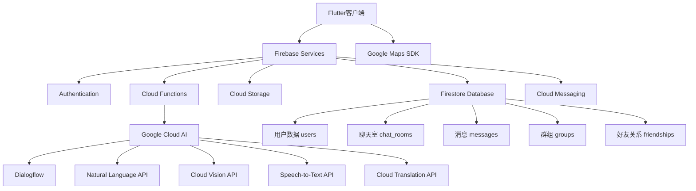

# MyChatApp - 现代化实时聊天应用

一个基于Flutter和Firebase构建的全功能实时通讯应用，集成Google Cloud AI服务，提供智能化、便捷化的聊天体验。

## 🚀 项目概述

MyChatApp是一款现代化的实时通讯应用，不仅提供稳定、即时的基础聊天功能，更借助Google Cloud的强大AI能力，致力于打造更智能、更便捷、更丰富的沟通体验。

### 核心特色

- 🔥 **实时通讯** - 基于Firebase Firestore的毫秒级消息同步
- 🤖 **AI智能助手** - 集成Google Cloud AI服务
- 👥 **群组管理** - 完整的群聊创建和管理功能
- 🌍 **位置服务** - 基于Google Maps的位置分享
- 📱 **跨平台支持** - 支持Android、iOS、Web等多平台
- 🔐 **安全可靠** - Firebase Authentication + Firestore安全规则

## 📋 功能框架（三阶段开发）

### 第一阶段：核心功能 (MVP)

#### 🔐 用户认证系统
- **Firebase Authentication** - 邮箱/密码注册登录
- **用户资料管理** - 昵称、头像、状态设置
- **自动数据同步** - 注册时自动创建Firestore用户文档

#### 💬 实时一对一聊天
- **实时消息同步** - 基于Firestore Streams
- **消息状态显示** - 已发送、已送达、已读状态
- **聊天室管理** - 自动创建和管理聊天室

#### 👥 通讯录管理
- **用户列表** - 显示所有注册用户
- **好友系统** - 添加好友、好友请求管理
- **搜索功能** - 快速查找用户

#### 📢 推送通知
- **FCM集成** - Firebase Cloud Messaging
- **离线通知** - 后台消息推送
- **Cloud Functions** - 自动触发通知

### 第二阶段：扩展功能

#### 📸 多媒体消息
- **图片分享** - Firebase Storage集成
- **语音消息** - 录音和播放功能
- **视频消息** - 短视频录制和分享
- **文件传输** - 支持各种文件格式

#### 👥 群组聊天
- **群组创建** - 支持多人群聊
- **成员管理** - 添加/移除成员、管理员权限
- **群组设置** - 群名、群头像、公告等

#### 🟢 在线状态
- **实时状态** - 在线/离线/正在输入
- **Realtime Database** - 高效的状态同步
- **输入指示器** - 显示对方输入状态

#### 🔄 消息交互
- **消息回复** - 引用回复功能
- **表情反应** - 快速表情回应
- **消息转发** - 转发给其他联系人

### 第三阶段：AI智能功能

#### 🗺️ 地图与位置服务
- **位置分享** - 实时位置共享
- **POI搜索** - 兴趣点搜索和分享
- **附近的人** - 基于地理位置的社交发现

#### 🤖 智能对话助手
- **Dialogflow集成** - AI客服和助手
- **智能回复** - 自动回复建议
- **情绪分析** - 消息情绪识别
- **实时翻译** - 多语言无障碍沟通

#### 👁️ 图像智能分析
- **OCR文字识别** - 图片文字提取
- **内容识别** - 图片内容自动标签
- **安全审查** - 不当内容自动检测

#### 🎤 语音智能服务
- **语音转文字** - Speech-to-Text集成
- **语音命令** - 语音操作支持

## 🏗️ 技术架构

### 技术栈

#### 前端框架
- **Flutter 3.0+** - 跨平台UI框架
- **Dart** - 现代化编程语言
- **Material Design 3** - Google设计规范

#### 后端服务
- **Firebase**
  - Authentication - 用户认证
  - Firestore - 实时数据库
  - Storage - 文件存储
  - Cloud Functions - 服务端逻辑
  - Cloud Messaging - 推送通知

#### Google Cloud AI服务
- **Dialogflow** - 对话AI
- **Natural Language API** - 自然语言处理
- **Cloud Translation** - 实时翻译
- **Cloud Vision** - 图像分析
- **Speech-to-Text** - 语音识别
- **Maps SDK** - 地图服务

### 系统架构图



## 📁 项目结构

```
mychatapp/
├── lib/                           # 📱 Flutter应用源码
│   ├── main.dart                 # 应用入口
│   ├── firebase_options.dart     # Firebase配置
│   ├── models/                   # 📊 数据模型层
│   │   ├── user_model.dart       # 用户数据模型
│   │   ├── message_model.dart    # 消息数据模型
│   │   ├── chat_room_model.dart  # 聊天室数据模型
│   │   ├── group_model.dart      # 群组数据模型
│   │   ├── friend_request_model.dart # 好友请求模型
│   │   ├── media_attachment_model.dart # 媒体附件模型
│   │   ├── notification_model.dart # 通知模型
│   │   ├── presence_model.dart   # 在线状态模型
│   │   ├── location_model.dart   # 位置数据模型
│   │   └── models.dart          # 模型统一导出
│   ├── services/                # 🔧 业务逻辑服务层
│   │   ├── auth_service.dart    # 认证服务
│   │   ├── chat_service.dart    # 聊天服务
│   │   ├── user_service.dart    # 用户管理服务
│   │   ├── friend_service.dart  # 好友管理服务
│   │   ├── group_service.dart   # 群组管理服务
│   │   ├── media_service.dart   # 媒体处理服务
│   │   ├── notification_service.dart # 通知服务
│   │   ├── presence_service.dart # 在线状态服务
│   │   └── location_service.dart # 位置服务
│   ├── screens/                 # 🖥️ 用户界面屏幕
│   │   ├── auth_gate.dart       # 认证路由守卫
│   │   ├── login_screen.dart    # 登录页面
│   │   ├── register_screen.dart # 注册页面
│   │   ├── home_screen.dart     # 主页面
│   │   ├── chat_screen.dart     # 聊天界面
│   │   ├── contacts_screen.dart # 联系人页面
│   │   ├── group_chat_screen.dart # 群聊界面
│   │   ├── add_friend_screen.dart # 添加好友页面
│   │   ├── friend_requests_screen.dart # 好友请求页面
│   │   ├── profile_screen.dart  # 个人资料页面
│   │   ├── create_group_screen.dart # 创建群组页面
│   │   ├── group_details_screen.dart # 群组详情页面
│   │   └── map_screen.dart      # 地图页面
│   ├── widgets/                 # 🎨 UI组件
│   │   ├── message_bubble.dart  # 消息气泡组件
│   │   ├── typing_indicator.dart # 输入指示器
│   │   └── anti_addiction_widget.dart # 防沉迷组件
│   └── utils/                   # 🛠️ 工具类
│       └── network_checker.dart # 网络状态检查
├── android/                     # 🤖 Android平台配置
├── ios/                         # 🍎 iOS平台配置
├── web/                         # 🌐 Web平台配置
├── functions/                   # ☁️ Cloud Functions
├── firestore.rules             # 🔒 Firestore安全规则
├── storage.rules               # 🔒 Storage安全规则
├── firebase.json               # Firebase项目配置
├── pubspec.yaml               # 📦 项目依赖配置
├── blueprint.md               # 📋 项目蓝图设计
├── DEPLOYMENT_GUIDE.md        # 🚀 部署指南
├── FCM_SETUP_GUIDE.md         # 📢 推送通知配置
└── FRIEND_SYSTEM_GUIDE.md     # 👥 好友系统指南
```

## 🗄️ 数据库设计

### Firestore集合结构

#### 用户集合 (users)
```dart
class UserModel {
  final String uid;
  final String email;
  final String displayName;
  final String? photoUrl;
  final String? bio;
  final DateTime createdAt;
  final DateTime lastSeen;
  final bool isOnline;
  final String? fcmToken;
}
```

#### 聊天室集合 (chat_rooms)
```dart
class ChatRoomModel {
  final String id;
  final List<String> participantIds;
  final String? lastMessage;
  final String? lastSenderId;
  final DateTime? lastMessageTime;
  final Map<String, DateTime> lastReadTimes;
  final DateTime createdAt;
}
```

#### 消息集合 (messages)
```dart
class MessageModel {
  final String id;
  final String chatRoomId;
  final String senderId;
  final String text;
  final MessageType type;
  final DateTime timestamp;
  final MessageStatus status;
  final String? replyToMessageId;
  final MediaAttachmentModel? mediaAttachment;
  final LocationModel? location;
}
```

#### 群组集合 (groups)
```dart
class GroupModel {
  final String id;
  final String name;
  final String? description;
  final String? photoUrl;
  final List<String> memberIds;
  final List<String> adminIds;
  final String creatorId;
  final DateTime createdAt;
  final GroupSettings settings;
}
```

### Firestore安全规则

```javascript
rules_version = '2';
service cloud.firestore {
  match /databases/{database}/documents {
    // 用户数据规则
    match /users/{userId} {
      allow read, write: if request.auth != null && request.auth.uid == userId;
      allow read: if request.auth != null;
    }
    
    // 聊天室规则
    match /chat_rooms/{chatRoomId} {
      allow read, write: if request.auth != null && 
        request.auth.uid in resource.data.participantIds;
    }
    
    // 消息规则
    match /messages/{messageId} {
      allow create: if request.auth != null && 
        request.auth.uid == request.resource.data.senderId;
      allow read: if request.auth != null;
    }
  }
}
```

## 🚀 快速开始

### 环境要求

- **Flutter SDK**: 3.0.0+
- **Dart SDK**: 2.18.0+
- **Firebase CLI**: 最新版本
- **Android Studio** / **VS Code**
- **Firebase项目**: 已配置的Firebase项目

### 安装步骤

#### 1. 克隆项目
```bash
git clone <your-repository-url>
cd mychatapp
```

#### 2. 安装依赖
```bash
flutter pub get
```

#### 3. Firebase配置

##### 创建Firebase项目
1. 访问 [Firebase Console](https://console.firebase.google.com/)
2. 创建新项目
3. 启用以下服务：
   - Authentication (Email/Password)
   - Firestore Database
   - Cloud Storage
   - Cloud Functions
   - Cloud Messaging

##### 配置应用
```bash
# 安装Firebase CLI
npm install -g firebase-tools

# 登录Firebase
firebase login

# 配置Flutter应用
flutterfire configure
```

#### 4. Google Cloud API配置

在Google Cloud Console中启用以下API：
- Dialogflow API
- Natural Language API
- Cloud Translation API
- Cloud Vision API
- Speech-to-Text API
- Maps SDK for Android/iOS

#### 5. 配置推送通知

参考 `FCM_SETUP_GUIDE.md` 配置Firebase Cloud Messaging

#### 6. 部署Cloud Functions
```bash
cd functions
npm install
firebase deploy --only functions
```

#### 7. 运行应用
```bash
flutter run
```

## 📱 主要功能演示

### 用户认证流程
- **注册页面** - 邮箱密码注册，实时验证
- **登录页面** - 安全登录，记住登录状态
- **个人资料** - 头像上传、昵称设置

### 聊天功能
- **一对一聊天** - 实时消息同步
- **群组聊天** - 多人实时群聊
- **消息类型** - 文本、图片、语音、位置
- **消息状态** - 发送、送达、已读状态显示

### 智能功能
- **AI助手** - 智能客服对话
- **语音转文字** - 语音消息自动转换
- **图片识别** - 图片内容自动分析
- **实时翻译** - 多语言无障碍沟通

### 社交功能
- **好友系统** - 添加好友、管理联系人
- **位置分享** - 实时位置共享
- **群组管理** - 创建群组、成员管理

## 🔧 开发指南

### 数据模型使用

```dart
// 创建用户模型
final user = UserModel(
  uid: 'user123',
  email: 'user@example.com',
  displayName: 'John Doe',
  createdAt: DateTime.now(),
);

// 发送消息
final message = MessageModel(
  id: 'msg123',
  chatRoomId: 'room123',
  senderId: 'user123',
  text: 'Hello, World!',
  type: MessageType.text,
  timestamp: DateTime.now(),
  status: MessageStatus.sent,
);
```

### 服务层使用

```dart
// 认证服务
final authService = AuthService();
await authService.signInWithEmailAndPassword(email, password);

// 聊天服务
final chatService = ChatService();
await chatService.sendMessage(chatRoomId, message);

// 用户服务
final userService = UserService();
final users = await userService.getAllUsers();
```

### 实时数据监听

```dart
// 监听聊天室消息
StreamBuilder<List<MessageModel>>(
  stream: chatService.getMessagesStream(chatRoomId),
  builder: (context, snapshot) {
    if (snapshot.hasData) {
      final messages = snapshot.data!;
      return ListView.builder(
        itemCount: messages.length,
        itemBuilder: (context, index) {
          return MessageBubble(message: messages[index]);
        },
      );
    }
    return CircularProgressIndicator();
  },
);
```

## 🧪 测试指南

### 单元测试
```bash
flutter test
```

### 集成测试
```bash
flutter test integration_test/
```

### Firestore规则测试
```bash
cd functions
npm run test
```

## 🚢 部署指南

### Android发布
```bash
flutter build apk --release
flutter build appbundle --release
```

### iOS发布
```bash
flutter build ios --release
```

### Web部署
```bash
flutter build web --release
firebase deploy --only hosting
```

### Cloud Functions部署
```bash
firebase deploy --only functions
```

## 📊 性能优化

### Firestore优化
- **复合索引** - 为复杂查询创建索引
- **分页查询** - 使用limit和cursor分页
- **离线支持** - 启用离线数据缓存

### UI性能优化
- **图片缓存** - 使用cached_network_image
- **懒加载** - ListView.builder延迟加载
- **状态管理** - 使用Provider或Riverpod

### 网络优化
- **请求合并** - 批量处理API请求
- **缓存策略** - 合理使用本地缓存
- **离线模式** - 支持离线操作

## 🔒 安全考虑

### 数据安全
- **Firestore规则** - 严格的数据访问控制
- **用户隐私** - 敏感信息加密存储
- **内容审核** - AI自动检测不当内容

### 应用安全
- **认证安全** - 强密码策略
- **数据传输** - HTTPS加密传输
- **权限管理** - 最小权限原则

## 🤝 贡献指南

1. Fork 项目
2. 创建特性分支 (`git checkout -b feature/amazing-feature`)
3. 提交更改 (`git commit -m 'Add amazing feature'`)
4. 推送到分支 (`git push origin feature/amazing-feature`)
5. 创建 Pull Request

### 开发规范
- 遵循Flutter/Dart代码规范
- 完善的单元测试覆盖
- 详细的commit信息
- 代码审查必须通过

## 📄 许可证

本项目基于 MIT 许可证开源。详见 [LICENSE](LICENSE) 文件。

## 📚 学习资源

### 官方文档
- [Flutter官方文档](https://docs.flutter.dev/)
- [Firebase文档](https://firebase.google.com/docs)
- [Google Cloud API文档](https://cloud.google.com/docs)

### 推荐教程
- [Flutter聊天应用教程](https://www.youtube.com/watch?v=example)
- [Firebase实战指南](https://firebase.google.com/codelabs)
- [Google Cloud AI服务入门](https://cloud.google.com/ai)

## 📞 联系支持

如有问题或建议，请通过以下方式联系：
- 创建 [GitHub Issue](https://github.com/your-repo/issues)
- 发送邮件至：support@mychatapp.com
- 查看项目 [Wiki](https://github.com/your-repo/wiki)

---

**开发团队** | **最后更新**: 2024年10月10日

让智能沟通连接世界！ 🌟
