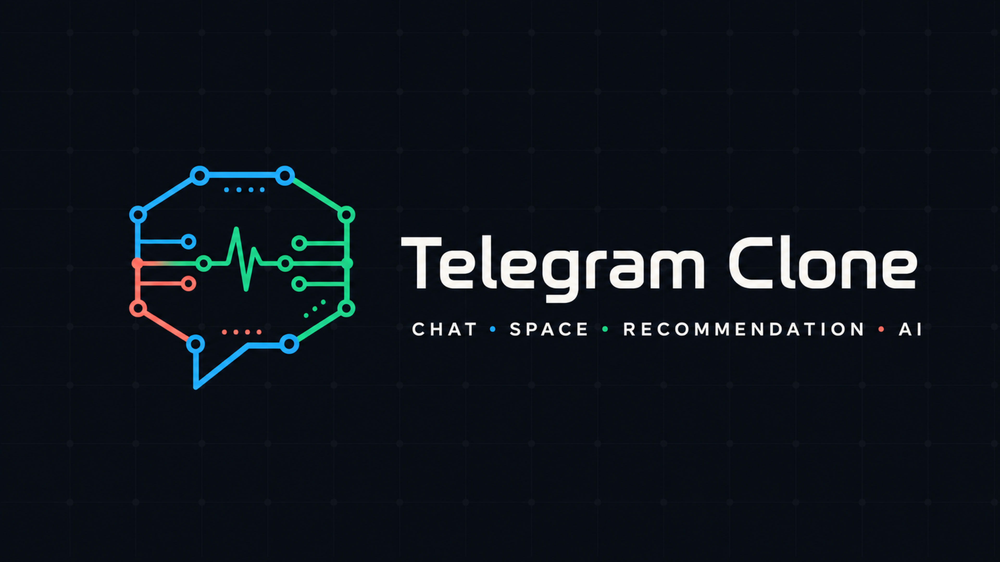
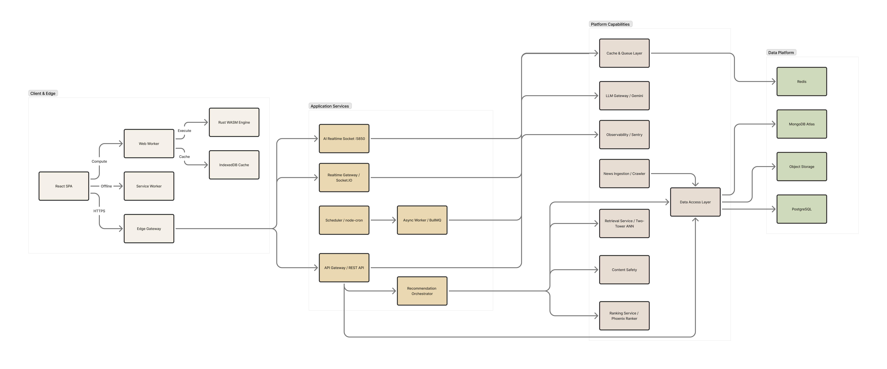

<h1 align="center">Telegram Clone</h1>

<p align="center">
  
</p>

<p align="center">
  一个面向真实工程边界构建的实时通信与智能社交平台：聊天、Space 动态、推荐系统、AI 助手和多语言执行面汇聚在同一套仓库中。
</p>

<p align="center">
  
  
  
  
  
</p>

<p align="center">
  <a href="#核心能力">核心能力</a> ·
  <a href="#系统架构">系统架构</a> ·
  <a href="#快速开始">快速开始</a> ·
  <a href="#开发与验证">开发与验证</a> ·
  <a href="#部署与运维">部署与运维</a>
</p>

> [!NOTE]
> 这是一个受 Telegram 产品体验启发的独立工程项目，不是 Telegram 官方客户端，也与 Telegram FZ-LLC 无隶属关系。

## 项目定位

Telegram Clone 不只是聊天界面复刻。项目从实时消息出发，逐步加入社交 Feed、个性化推荐、AI 对话、新闻聚合、离线能力，以及围绕发布、回退和可观测性的运行时控制面。

当前生产形态采用明确的能力归属：Node.js 保留公开 API、认证、数据访问与控制面；Rust 承担实时入口和推荐主执行；Go 处理可回放的平台事件与消息投递；C++ 提供图数据面；Python 承担模型推理、训练和轻量任务。

## 核心能力

| 能力 | 当前实现 |
| --- | --- |
| **实时通信** | 私聊、群聊、在线状态、输入状态、已读同步、表情反应、文件上传，以及 PTS/QTS gap recovery |
| **Space 社交** | 动态 Feed、发帖、评论、点赞、转发、关注关系、个人主页、趋势与通知 |
| **个性化推荐** | Source → Hydrator → Filter → Scorer → Selector → Side Effect 分阶段管道，支持图召回、ANN 召回、排序与回放评估 |
| **AI 与 ML** | Gemini 多模态对话、Two-Tower/FAISS 召回、Phoenix 排序、内容安全与新闻 NLP 聚合 |
| **离线与性能** | PWA、IndexedDB、Web Worker、Comlink、虚拟列表、缓存与 Rust/WASM 客户端加速 |
| **生产控制面** | 健康检查、运行时摘要、回放、灰度、fallback、DLQ、指标与发布门禁 |

## 系统架构

<p align="center">
  
</p>

上图展示客户端、应用服务和数据平台之间的逻辑能力流；当前运行时 owner 以仓库内的部署清单和服务入口为准。

| 边界 | Canonical owner | 职责 |
| --- | --- | --- |
| Web Client | React + TypeScript | Chat、Space、News、Admin、PWA、Worker 与本地数据投影 |
| Public API / Control Plane | Node.js + Express + Socket.IO | 认证、公开 API、上传、数据 provider、控制面与 fallback adapter |
| Realtime Edge | Rust Gateway | HTTP/Socket 入口、限流、鉴权、实时协议与兼容边界 |
| Recommendation Runtime | Rust Workspace | 候选管道、排序、选择、共享契约和 serving primitives |
| Platform Delivery | Go Consumer | Redis Streams 消费、投递投影、重试、回放与 DLQ |
| Graph Data Plane | C++ Graph Kernel | 图快照、邻居检索、重叠计算和运行时诊断 |
| ML / Offline Jobs | Python | ANN、Phoenix、安全推理、训练、爬取与归档任务 |
| Data Platform | MongoDB + PostgreSQL + Redis | 业务状态、关系数据、缓存、队列与事件流 |

### 关键工程边界

- **Public boundary stays in Node**：外部接口、认证和数据访问不分散到多个服务。
- **Latency-sensitive paths move to Rust/C++**：实时入口、推荐编排和图检索拥有清晰的低延迟 owner。
- **Replayable work stays in Go**：投递与平台事件通过可恢复、可观测的消费路径执行。
- **Models remain replaceable**：Python 模型服务通过版本化契约接入 serving path，而不是直接拥有公开 API。
- **Fallback is part of the design**：灰度、回放、DLQ 和 Node fallback 都是发布路径的一部分。

## 快速开始

当前最短的可复现路径是 `deploy/vps` 下的本地 build-first 核心服务 profile。

### 环境要求

- Docker 24+ 与 Docker Compose v2
- 可访问的 MongoDB 和 PostgreSQL 实例
- 至少 8 GB 可用内存用于同时构建多语言服务

### 1. 获取代码

```bash
git clone https://github.com/wssAchilles/Mycode.git
cd Mycode/telegram
```

### 2. 准备环境变量

```bash
cp deploy/vps/backend.env.example deploy/vps/backend.env
```

至少填写以下值：

```dotenv
MONGODB_URI=
DATABASE_URL=
JWT_SECRET=
GEMINI_API_KEY=
FRONTEND_ORIGIN=
OPS_METRICS_TOKEN=
```

不要提交真实的 `backend.env`、数据库凭据、令牌或 API key。

### 3. 启动核心服务

```bash
cd deploy/vps
docker compose up -d --build
docker compose ps
curl http://127.0.0.1:4000/health
```

该 profile 会启动 Redis、Node backend、Rust gateway、Rust recommendation 和 Go delivery consumer。前端、Python ML 服务和 C++ graph kernel 不在这个本地 profile 中；完整生产拓扑见 [`deploy/vps/docker-compose.prod.yml`](deploy/vps/docker-compose.prod.yml)。

## 开发与验证

仓库根目录不是统一的 JavaScript workspace。请在对应服务目录安装依赖和运行命令。

### 前端

```bash
cp telegram-clone-frontend/.env.example telegram-clone-frontend/.env
cd telegram-clone-frontend
npm ci
npm run dev
```

前端读取 `VITE_API_BASE_URL` 和 `VITE_SOCKET_URL`。修改 `.env` 后需要重启 Vite。

### Node 后端

```bash
cp deploy/vps/backend.env.example telegram-clone-backend/.env
cd telegram-clone-backend
npm ci
npm run dev
```

本机运行时，需要把 `.env` 中的容器主机名和 Redis 地址改为本机可达地址。

### Python ML 服务

```bash
cd ml-services
python3 -m venv .venv
source .venv/bin/activate
pip install -r requirements.txt
uvicorn app:app --reload --port 8000
```

模型训练、索引构建和 artifact 发布流程见 [`ml-services/README.md`](ml-services/README.md)。

### 高价值门禁

只运行与你修改边界相关的最小门禁：

| 边界 | 命令 |
| --- | --- |
| Node API | `cd telegram-clone-backend && npm run build && npm test` |
| React Client | `cd telegram-clone-frontend && npm run quality:ci` |
| Rust Recommendation | `bash telegram-rust-workspace/scripts/quick-gate.sh` |
| Rust Gateway | `cargo test --manifest-path telegram-rust-gateway/Cargo.toml` |
| Go Delivery | `bash telegram-go-delivery-consumer/scripts/verify/go_default.sh` |
| C++ Graph | `bash telegram-cpp-graph-service/scripts/verify/ci_verify_graph.sh` |
| Python ML | `cd ml-services && python -m unittest test_feed_recommend_dedup.py` |

## 仓库地图

```text
telegram/
├── telegram-clone-frontend/       # React 19 SPA / PWA / Worker / WASM
├── telegram-clone-backend/        # Node public API, auth, data and control plane
├── telegram-rust-gateway/         # Rust realtime and ingress edge
├── telegram-rust-workspace/       # Recommendation runtime and shared primitives
├── telegram-go-delivery-consumer/ # Delivery, replay and platform-event execution
├── telegram-cpp-graph-service/    # Graph retrieval kernel and snapshot diagnostics
├── ml-services/                   # ANN, Phoenix, safety and training workflows
├── telegram-light-jobs/           # Lightweight crawl and archive jobs
├── deploy/vps/                    # Compose, release, rollback and VPS operations
└── docs/                          # Architecture, contracts, plans and research records
```

## 运行时数据路径

```text
React Client
    │
    ▼
Rust Gateway ─────► Node Public API / Control Plane
    │                         │
    │                         ├────► Rust Recommendation ─────► C++ Graph Kernel
    │                         │                  │
    │                         │                  └────► Python ML Services
    │                         │
    └──── realtime/events ────┴────► Redis Streams ─────► Go Delivery Consumer
                                      │
                                      └────► MongoDB / PostgreSQL projections
```

## Demo 数据

后端提供一组可重复的面试演示脚本：

| 命令 | 作用 |
| --- | --- |
| `npm run demo:prepare` | 重建 demo cohort、社交图、推荐帖子和聊天状态 |
| `npm run demo:live` | 持续生成消息、互动和在线状态变化 |
| `npm run demo:reset` | 删除 demo cohort，恢复干净状态 |

```bash
cd telegram-clone-backend
npm run demo:prepare
npm run demo:live
```

`demo:reset` 会执行删除操作，只应在确认目标环境和 cohort 后运行。演示脚本使用后端环境变量，不会替你创建数据库、Redis 或外部服务凭据。

## 部署与运维

维护中的部署路径是 VPS + Docker Compose：

- `docker-compose.yml`：从本地源码构建的核心服务 smoke profile
- `docker-compose.prod.yml`：使用 GHCR 镜像的生产 profile
- `release_backend.sh`：release 目录、dry-run、镜像检查与远程发布
- `bootstrap_vps.sh`：VPS 基线初始化

完整的环境准备、dry-run、发布、回滚和内部端点说明见 [`deploy/vps/README.md`](deploy/vps/README.md)。发布前先生成 dry-run 计划，并保持真实 env 文件位于 release 目录之外。

## 安全边界

- 所有外部输入都应视为不可信；公开接口由鉴权、验证、限流和错误处理中间件保护。
- JWT、数据库连接、Gemini key、内部服务 token 和 ops token 只通过环境变量或 secret manager 注入。
- 默认只公开 gateway；backend、recommendation、delivery consumer 与 graph kernel 端口应保持在私网或 localhost。
- 项目包含 Signal Protocol、内容审核和加密相关实现，但在正式处理敏感数据前仍需要独立威胁建模与安全审计。

## 文档索引

- [VPS 部署与发布](deploy/vps/README.md)
- [Rust recommendation workspace](telegram-rust-workspace/README.md)
- [Phoenix / Two-Tower ML 服务](ml-services/README.md)
- [推荐算法研究设计](docs/superpowers/specs/2026-07-07-recommendation-algorithm-research-design.md)
- [Embedding 契约修复设计](docs/superpowers/specs/2026-07-13-recommendation-embedding-contract-remediation-design.md)

## 贡献

1. 从最新 `master` 创建聚焦单一边界的分支。
2. 只修改完成目标所需的文件，并运行对应的最小门禁。
3. 提交前检查 `git diff`，避免带入本地 env、模型产物或无关改动。
4. 使用 Conventional Commits；提交标题与正文使用中文。

```text
feat(chat): 增加消息同步恢复能力

- 收敛断线后的 gap recovery 路径
- 补充关键回归验证
```

## 许可

仓库当前未提供统一的根级 `LICENSE` 文件，因此本 README 不声明 MIT、Apache-2.0 或其他开源许可证。正式使用、修改或分发前，请先与仓库所有者确认许可边界。

## 致谢

项目交互体验受 [Telegram](https://telegram.org/) 启发，推荐系统工程参考了公开的 [X Algorithm](https://github.com/twitter/the-algorithm) 思路。所有品牌、商标与产品名称归各自权利人所有。
