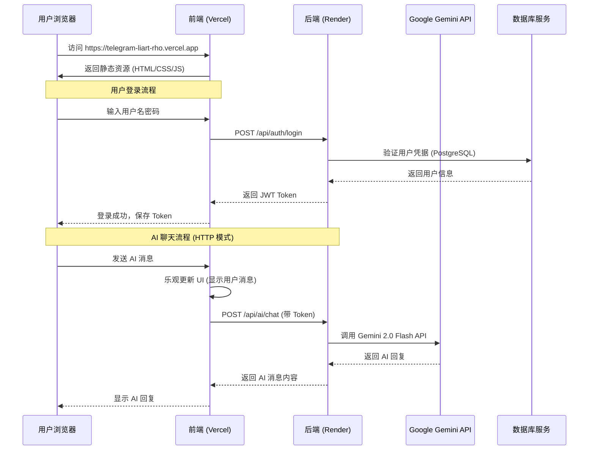

# 🚀 Telegram Clone 云端部署架构详解

## 📍 服务部署地址

| 服务 | 平台 | 部署地址 | 状态 |
| :--- | :--- | :--- | :--- |
| **前端应用** | Vercel | https://telegram-liart-rho.vercel.app | ✅ 运行中 |
| **后端 API** | Render | https://telegram-clone-backend-88ez.onrender.com | ✅ 运行中 |
| **PostgreSQL** | Supabase | 通过 Connection Pooler 连接 | ✅ 连接正常 |
| **MongoDB** | MongoDB Atlas | 云托管 | ✅ 连接正常 |
| **Redis** | Upstash | 云托管 | ✅ 连接正常 |

---

## 🔄 前后端交互流程图



---

## 🌐 环境变量配置

### 前端 (Vercel 环境变量)

| 变量名 | 值 | 说明 |
| :--- | :--- | :--- |
| `VITE_API_BASE_URL` | `https://telegram-clone-backend-88ez.onrender.com` | 后端 API 基础地址 |
| `VITE_SOCKET_URL` | `wss://telegram-clone-backend-88ez.onrender.com` | WebSocket 地址 (生产环境禁用) |

### 后端 (Render 环境变量)

| 变量名 | 说明 | 配置方式 |
| :--- | :--- | :--- |
| `NODE_ENV` | `production` | render.yaml 预设 |
| `PORT` | `10000` | render.yaml 预设 |
| `DATABASE_URL` | Supabase PostgreSQL 连接字符串 | Dashboard 手动设置 |
| `MONGODB_URI` | MongoDB Atlas 连接字符串 | Dashboard 手动设置 |
| `REDIS_URL` | Upstash Redis 连接字符串 | Dashboard 手动设置 |
| `JWT_SECRET` | JWT 签名密钥 | Dashboard 手动设置 |
| `GEMINI_API_KEY` | Google AI Studio API Key | Dashboard 手动设置 |
| `NODE_OPTIONS` | `--dns-result-order=ipv4first` | render.yaml 预设 |

---

## 📡 API 端点列表

### 认证模块 `/api/auth`

| 方法 | 端点 | 说明 | 鉴权 |
| :--- | :--- | :--- | :--- |
| POST | `/register` | 用户注册 | ❌ |
| POST | `/login` | 用户登录 | ❌ |
| POST | `/refresh` | 刷新 Token | ❌ |
| GET | `/me` | 获取当前用户 | ✅ |

### AI 模块 `/api/ai`

| 方法 | 端点 | 说明 | 鉴权 |
| :--- | :--- | :--- | :--- |
| POST | `/chat` | 发送消息给 AI | ✅ |
| GET | `/health` | AI 服务健康检查 | ✅ |
| GET | `/info` | 获取 AI 服务信息 | ✅ |

### 消息模块 `/api/messages`

| 方法 | 端点 | 说明 | 鉴权 |
| :--- | :--- | :--- | :--- |
| GET | `/conversation/:receiverId` | 获取私聊记录 | ✅ |
| GET | `/group/:groupId` | 获取群聊记录 | ✅ |
| POST | `/send` | 发送消息 | ✅ |
| PUT | `/read` | 标记消息已读 | ✅ |
| DELETE | `/:messageId` | 删除消息 | ✅ |
| GET | `/unread-count` | 获取未读数 | ✅ |

### 联系人模块 `/api/contacts`

| 方法 | 端点 | 说明 | 鉴权 |
| :--- | :--- | :--- | :--- |
| GET | `/` | 获取联系人列表 | ✅ |
| POST | `/add` | 添加联系人 | ✅ |
| GET | `/pending-requests` | 获取待处理请求 | ✅ |
| PUT | `/requests/:requestId` | 处理联系人请求 | ✅ |
| DELETE | `/:contactId` | 删除联系人 | ✅ |
| GET | `/search` | 搜索用户 | ✅ |

### 群组模块 `/api/groups`

| 方法 | 端点 | 说明 | 鉴权 |
| :--- | :--- | :--- | :--- |
| POST | `/` | 创建群组 | ✅ |
| GET | `/my` | 获取我的群组 | ✅ |
| GET | `/:groupId` | 获取群组详情 | ✅ |
| PUT | `/:groupId` | 更新群组 | ✅ |
| DELETE | `/:groupId` | 删除群组 | ✅ |
| POST | `/:groupId/members` | 添加成员 | ✅ |
| DELETE | `/:groupId/members/:memberId` | 移除成员 | ✅ |
| POST | `/:groupId/leave` | 退出群组 | ✅ |

### 文件上传 `/api`

| 方法 | 端点 | 说明 | 鉴权 |
| :--- | :--- | :--- | :--- |
| POST | `/upload` | 上传文件 | ✅ |
| GET | `/uploads/:filename` | 下载文件 | ❌ |
| GET | `/uploads/thumbnails/:filename` | 获取缩略图 | ❌ |

---

## 🔒 认证机制

### JWT Token 流程

```
1. 用户登录 → 后端返回 accessToken + refreshToken
2. 前端存储 Token 到 localStorage
3. 每次请求自动在 Header 添加: Authorization: Bearer <accessToken>
4. Token 过期时，使用 refreshToken 自动刷新
```

### Token 存储位置 (前端)

```javascript
localStorage.setItem('accessToken', token);
localStorage.setItem('refreshToken', refreshToken);
```

---

## 📦 数据库架构

| 数据库 | 用途 | 存储内容 |
| :--- | :--- | :--- |
| **PostgreSQL** | 主数据库 | 用户、联系人、群组、消息元数据 |
| **MongoDB** | 文档存储 | 消息内容、文件元数据 |
| **Redis** | 缓存 | 会话、在线状态、实时数据 |

---

## ⚙️ 特殊配置说明

### 1. IPv4 优先 (解决 Supabase 连接问题)

```yaml
# render.yaml
NODE_OPTIONS: "--dns-result-order=ipv4first"
```

### 2. AI Socket 禁用

生产环境中，出于稳定性考虑，后端的 AI Socket.IO 服务被禁用。前端会自动降级使用 HTTP API：

```
AI_SOCKET_ENABLED=false (Render 默认)
```

前端检测到 Socket 不可用时，会通过 `/api/ai/chat` HTTP 端点通信。

### 3. CORS 白名单

后端已配置允许的前端域名：

```typescript
// cors.ts
const allowedOrigins = [
  'https://telegram-liart-rho.vercel.app',
  /\.vercel\.app$/
];
```

---

## 🧪 API 调用示例

### 用户登录

```bash
curl -X POST https://telegram-clone-backend-88ez.onrender.com/api/auth/login \
  -H "Content-Type: application/json" \
  -d '{"username": "testuser", "password": "password123"}'
```

### AI 聊天

```bash
curl -X POST https://telegram-clone-backend-88ez.onrender.com/api/ai/chat \
  -H "Content-Type: application/json" \
  -H "Authorization: Bearer YOUR_JWT_TOKEN" \
  -d '{"message": "你好，请介绍一下你自己"}'
```

---

## 📊 部署架构总览

```
┌─────────────────────────────────────────────────────────────────┐
│                         用户浏览器                               │
└─────────────────────────────┬───────────────────────────────────┘
                              │ HTTPS
                              ▼
┌─────────────────────────────────────────────────────────────────┐
│                    Vercel (前端托管)                             │
│  https://telegram-liart-rho.vercel.app                          │
│  ┌─────────────────────────────────────────────────────────────┐│
│  │  React + TypeScript + Vite                                  ││
│  │  - apiClient.ts → 封装 Axios 请求                           ││
│  │  - socketService.ts → Socket.IO 客户端                      ││
│  │  - aiSocketService.ts → AI Socket + HTTP 回退               ││
│  └─────────────────────────────────────────────────────────────┘│
└─────────────────────────────┬───────────────────────────────────┘
                              │ HTTPS API 调用
                              ▼
┌─────────────────────────────────────────────────────────────────┐
│                    Render (后端托管)                             │
│  https://telegram-clone-backend-88ez.onrender.com               │
│  ┌─────────────────────────────────────────────────────────────┐│
│  │  Node.js + Express + TypeScript                             ││
│  │  路由: /api/auth, /api/messages, /api/ai, /api/contacts...  ││
│  └─────────────────────────────────────────────────────────────┘│
└───────┬─────────────────┬─────────────────┬─────────────────────┘
        │                 │                 │
        ▼                 ▼                 ▼
┌───────────────┐ ┌───────────────┐ ┌───────────────┐
│   Supabase    │ │ MongoDB Atlas │ │    Upstash    │
│  PostgreSQL   │ │   Documents   │ │     Redis     │
└───────────────┘ └───────────────┘ └───────────────┘
        │
        │ Gemini API 调用
        ▼
┌───────────────────┐
│  Google Gemini    │
│  (gemini-2.0-flash)│
└───────────────────┘
```

---

*文档生成时间: 2026-01-20*
