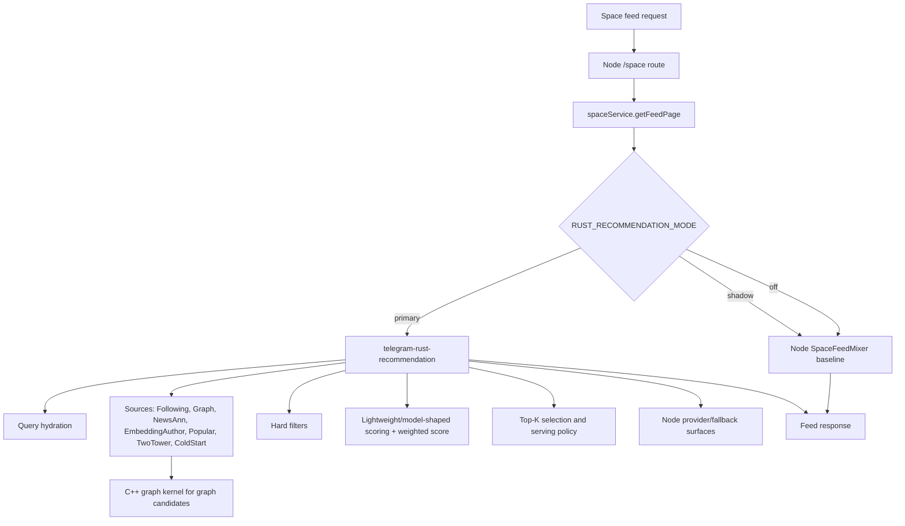
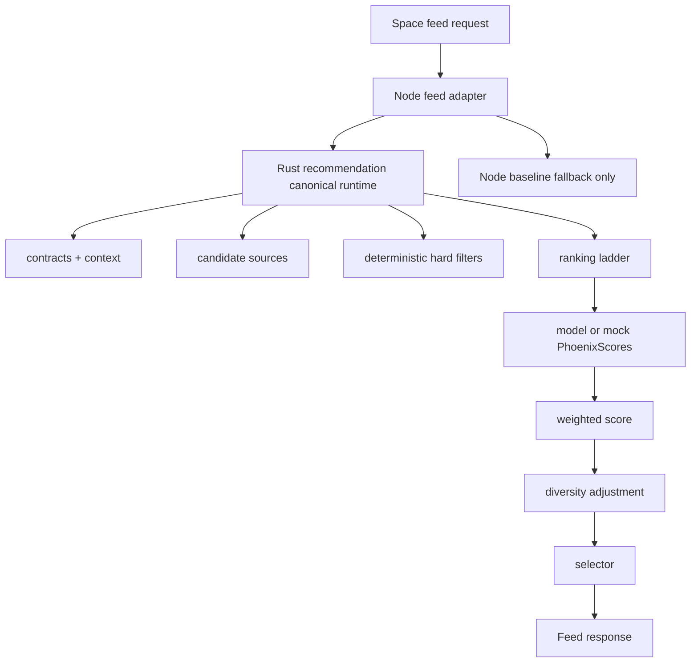

# Recommendation Algorithm Roadmap

Status: Phase 6 skeleton in progress, 2026-05-03

This document is the long-term control point for recommendation algorithm and code-shape work. It is intentionally limited to algorithm quality, code quality, and skeleton upgrades.

## Current Constraints

Do not modify these directories in the current stage:

- `ml-services/**`
- `telegram-light-jobs/**`

Those areas depend on Google Cloud model artifacts, jobs, and platform setup. They may be read for context, but all code changes must stay outside them until the GCP-dependent phase is explicitly opened.

Current stage does not cover:

- operations
- security
- monitoring
- output explanations
- online rollout mechanics
- GCP job implementation
- ML service refactors

## Phase 0 External Re-Read

Before this baseline was written, the following repositories and files were re-read through GitHub MCP:

`xai-org/x-algorithm`

- `README.md`
- `candidate-pipeline/candidate_pipeline.rs`
- `home-mixer/candidate_pipeline/phoenix_candidate_pipeline.rs`

Relevant ideas carried into this repo:

- Keep the feed algorithm as an explicit sequence of query hydration, sources, hydration, filters, scorers, selection, post-selection, and side effects.
- Treat in-network and out-of-network candidate lanes as first-class sources with stable attribution.
- Keep model action scores as the primary ranking input; weighted scoring should combine model outputs rather than become a hidden feature engine.
- Keep filters deterministic and separate from scoring.

`ultraworkers/claw-code`

- `rust/Cargo.toml`
- `rust/MOCK_PARITY_HARNESS.md`

Relevant ideas carried into this repo:

- Use a canonical runtime surface instead of allowing several implementations to grow in parallel.
- Prefer workspace-level Rust structure and shared contracts when multiple Rust services start sharing long-lived behavior.
- Build deterministic parity/replay harnesses with fixed scenarios before expanding implementation complexity.

Every future phase must repeat the corresponding GitHub MCP read before it is marked complete. Do not rely on prior memory of those repositories as the basis for a new phase.

## Current Recommendation Path

Important current facts:

- `telegram-rust-recommendation` already owns the canonical recommendation pipeline definition through `src/candidate_pipeline/definition.rs`.
- Node still contains a full baseline recommendation pipeline through `SpaceFeedMixer`.
- `spaceService.getFeedPage` currently decides between Node baseline, Rust shadow/primary, and fallback behavior.
- The current Rust path already has sources, filters, scorers, selectors, serving policy, and graph source orchestration.
- The current model-facing Python path remains outside this stage because `ml-services/**` is frozen.

## Target Recommendation Path

Target ownership:

| Area | Long-term owner | Current-stage rule |
|---|---|---|
| Feed API adapter | Node | Thin adapter only |
| New recommendation source logic | Rust | Add only in Rust |
| New filter logic | Rust | Add only in Rust |
| New ranking/scoring logic | Rust | Add only in Rust |
| Baseline fallback | Node | Preserve but do not expand |
| Model serving | Python ML | Frozen until GCP phase |
| Light jobs | Google Cloud jobs | Frozen until GCP phase |
| Graph candidate data plane | C++ graph kernel | Read-only dependency for current algorithm work |

## Code Growth Rules

Default placement for future recommendation algorithm code:

- Rust contracts: `telegram-rust-recommendation/src/contracts/`
- Rust query/context work: `telegram-rust-recommendation/src/pipeline/` or `src/query_hydrators/`
- Rust source work: `telegram-rust-recommendation/src/sources/`
- Rust filter work: `telegram-rust-recommendation/src/filters/` or `src/pipeline/local/filters.rs` until split further
- Rust scorer/ranking work: `telegram-rust-recommendation/src/scorers/` or `src/pipeline/local/scorers/`
- Rust selector work: `telegram-rust-recommendation/src/selectors/`
- Rust replay/eval work: a future `telegram-rust-recommendation/src/replay/` or test fixture module

Code that should shrink or stay frozen:

- `telegram-clone-backend/src/services/spaceService.ts`: keep as feed adapter and fallback coordinator; do not add new algorithm branches.
- `telegram-clone-backend/src/services/recommendation/SpaceFeedMixer.ts`: preserve as baseline/fallback; do not add new long-term strategy.
- `telegram-clone-backend/src/services/recommendation/scorers/`: do not add new long-term scorers here.
- `ml-services/**`: no edits in current stage.
- `telegram-light-jobs/**`: no edits in current stage.

## Algorithm Contract Direction

The next phase must converge these field meanings before adding new ranking behavior:

| Field | Contract direction |
|---|---|
| `postId` | Internal post identity used by Node/Rust feed surfaces |
| `externalId` | ML/corpus identity; record semantics now, implementation waits for ML/GCP phase |
| `authorId` | Stable author identity for source attribution, repeated-author penalty, and candidate features |
| `source` / `recallSource` | Stable candidate source component name |
| `inNetwork` | Candidate lane property, not a scoring side effect |
| `seenIds` | User/session exclusion input |
| `servedIds` | Recently served exclusion input |
| `userActionSequence` | Ordered user behavior context for future model scoring |
| `candidateFeatures` | Candidate-side features consumed by ranking; avoid free-form feature accretion |
| `phoenixScores` | Multi-action model or mock score container |
| `weightedScore` | Weighted combination of action scores |
| `finalScore` / `score` | Selector-facing score after ranking adjustments |

## Phase Gates

Phase 1 was opened after re-reading the following files through GitHub MCP:

- `xai-org/x-algorithm/home-mixer/candidate_pipeline/candidate.rs`
- `xai-org/x-algorithm/home-mixer/candidate_pipeline/query.rs`
- `xai-org/x-algorithm/home-mixer/scorers/weighted_scorer.rs`

The first local Phase 1 artifact is the shared fixture at `telegram-rust-recommendation/tests/fixtures/algorithm_contract_sample.json`, parsed by both Rust and Node tests. Node and Rust also project their existing recommendation boundary payloads into the canonical contract, so `postId`, `externalId`, `source`, `inNetwork`, `phoenixScores`, `weightedScore`, and `finalScore` now have a shared executable anchor.

The Phase 1 executable anchor was extended on 2026-05-03:

- `provenance` now carries primary source, retrieval lane, interest pool, secondary sources, selection pool, and selection reason.
- `scoreMetadata` now carries score contract and score breakdown versions.
- `externalId` remains a canonical ML/corpus identity placeholder: prefer news metadata external id, then `modelPostId` only when it differs from `postId`.
- The same fixture is validated by `telegram-rust-recommendation` and `telegram-clone-backend`.

Phase 2 was opened after re-reading the following files through GitHub MCP:

- `xai-org/x-algorithm/home-mixer/scorers/phoenix_scorer.rs`
- `xai-org/x-algorithm/home-mixer/scorers/weighted_scorer.rs`
- `xai-org/x-algorithm/home-mixer/scorers/author_diversity_scorer.rs`
- `xai-org/x-algorithm/home-mixer/selectors/top_k_score_selector.rs`

The first local Phase 2 artifact is the Rust local ranking ladder metadata in `telegram-rust-recommendation/src/pipeline/local/ranking/mod.rs` and its scorer-runner integration. `LightweightPhoenixScorer` is explicitly marked as fallback model-score generation, `WeightedScorer` owns weighted-score creation, rule stages are score adjustments, and `AuthorDiversityScorer` is the normal final-score writer. `OutOfNetworkScorer` was moved before final scoring and now adjusts `weightedScore` rather than writing selector-facing `score`.

Phase 3 was opened after re-reading the following files through GitHub MCP:

- `xai-org/x-algorithm/home-mixer/server.rs`
- `xai-org/x-algorithm/home-mixer/main.rs`
- `xai-org/x-algorithm/home-mixer/candidate_pipeline/phoenix_candidate_pipeline.rs`
- `ultraworkers/claw-code/rust/README.md`
- `ultraworkers/claw-code/rust/Cargo.toml`

The first local Phase 3 artifact is `telegram-clone-backend/src/services/recommendation/contracts/runtimeOwnership.ts`. It records Rust as the canonical recommendation algorithm owner and Node as `legacy_baseline_fallback`. `SpaceFeedMixer` now exposes this role explicitly; it is preserved for migration fallback, not for new source/scorer/ranking growth.

Phase 4 was opened after re-reading the following files through GitHub MCP:

- `ultraworkers/claw-code/rust/MOCK_PARITY_HARNESS.md`
- `ultraworkers/claw-code/rust/mock_parity_scenarios.json`
- `ultraworkers/claw-code/rust/crates/rusty-claude-cli/tests/mock_parity_harness.rs`
- `xai-org/x-algorithm/candidate-pipeline/candidate_pipeline.rs`

The first local Phase 4 artifact is the Rust replay module at `telegram-rust-recommendation/src/replay/`. It evaluates deterministic replay fixtures under `telegram-rust-recommendation/tests/fixtures/` without Python, GCP, or Node runtime calls. The replay harness now runs local pre-score filters before local ranking and TopK selection, so fixtures can pin hard-filter behavior as well as ranking behavior. `replay_warm_user.json` currently covers warm-user mock Phoenix scoring, cold-start fallback mix, negative author feedback suppression, and news `externalId` duplicate filtering. `replay_scenarios.json` is the scenario manifest; tests require it to stay aligned with fixture order and to record category, description, and parity references for each case. The expected-property contract can assert exact selected IDs, min/max selection count, required filtered IDs, rank-before relationships, repeated-author limits, and selected-per-external-id limits.

Phase 5 was opened after re-reading the following files through GitHub MCP:

- `ultraworkers/claw-code/rust/Cargo.toml`
- `ultraworkers/claw-code/rust/crates/runtime/src/lib.rs`
- `ultraworkers/claw-code/rust/crates/tools/src/lib.rs`
- `ultraworkers/claw-code/rust/crates/rusty-claude-cli/src/main.rs`

The first local Phase 5 artifact is `telegram-rust-workspace/`. It is intentionally a no-build-impact transition directory, not a root Cargo workspace yet. The current repo has independent `Cargo.lock` files for `telegram-rust-recommendation` and `telegram-rust-gateway`; directly creating a root workspace would change dependency resolution and lockfile ownership. The transition manifest records the intended shared crates and migration gates before that larger move.

Phase 6 was opened after re-reading the following files through GitHub MCP:

- `xai-org/x-algorithm/home-mixer/candidate_pipeline/phoenix_candidate_pipeline.rs`
- `xai-org/x-algorithm/home-mixer/sources/thunder_source.rs`
- `xai-org/x-algorithm/home-mixer/sources/phoenix_source.rs`
- `xai-org/x-algorithm/home-mixer/scorers/weighted_scorer.rs`

The first local Phase 6 artifact is the algorithm-version anchor in `telegram-rust-recommendation/src/candidate_pipeline/definition.rs`. The Rust runtime now records `rust_recommendation_algorithm_v1`, the `rust_only_new_algorithm_logic` growth policy, and the Node `legacy_baseline_fallback` role. The scorer manifest now derives from provider scorers plus the Rust local ranking ladder, so ops/readiness surfaces include `LightweightPhoenixScorer`, trend scorers, `InterestDecayScorer`, `IntraRequestDiversityScorer`, and the final `ScoreContractScorer` in the same order that execution uses. `OutOfNetworkScorer` remains a score-adjustment stage before `AuthorDiversityScorer` writes final selector-facing `score`.

### Phase 1 Gate: Algorithm Contract

Before completion:

- Re-read through GitHub MCP:
  - `xai-org/x-algorithm/home-mixer/candidate_pipeline/candidate.rs`
  - `xai-org/x-algorithm/home-mixer/candidate_pipeline/query.rs`
  - `xai-org/x-algorithm/home-mixer/scorers/weighted_scorer.rs`
- Add or update local contract fixtures outside `ml-services/**`.
- Prove Node and Rust understand the same contract fields.

### Phase 2 Gate: Rust Main Skeleton

Before completion:

- Re-read through GitHub MCP:
  - `xai-org/x-algorithm/home-mixer/scorers/phoenix_scorer.rs`
  - `xai-org/x-algorithm/home-mixer/scorers/weighted_scorer.rs`
  - `xai-org/x-algorithm/home-mixer/scorers/author_diversity_scorer.rs`
  - `xai-org/x-algorithm/home-mixer/selectors/top_k_score_selector.rs`
- Show that Rust source/filter/ranking/selection boundaries are explicit.
- Show that mock `PhoenixScores` can drive the complete ranking ladder.

### Phase 3 Gate: Node Responsibility Shrink

Before completion:

- Re-read through GitHub MCP:
  - `xai-org/x-algorithm/home-mixer/server.rs`
  - `xai-org/x-algorithm/home-mixer/main.rs`
  - `xai-org/x-algorithm/home-mixer/candidate_pipeline/phoenix_candidate_pipeline.rs`
  - `ultraworkers/claw-code/rust/README.md`
  - `ultraworkers/claw-code/rust/Cargo.toml`
- Keep Node as adapter/fallback; do not move new algorithm behavior into Node.

### Phase 4 Gate: Replay/Eval Skeleton

Before completion:

- Re-read through GitHub MCP:
  - `ultraworkers/claw-code/rust/MOCK_PARITY_HARNESS.md`
  - `ultraworkers/claw-code/rust/mock_parity_scenarios.json`
  - `ultraworkers/claw-code/rust/crates/rusty-claude-cli/tests/mock_parity_harness.rs`
  - `xai-org/x-algorithm/candidate-pipeline/candidate_pipeline.rs`
- Add deterministic replay fixtures that do not call `ml-services`.
- Validate ranking, filters, source merge, repeated author behavior, and negative-action suppression.

### Phase 5 Gate: Rust Workspace/Shared Skeleton

Before completion:

- Re-read through GitHub MCP:
  - `ultraworkers/claw-code/rust/Cargo.toml`
  - `ultraworkers/claw-code/rust/crates/runtime/src/lib.rs`
  - `ultraworkers/claw-code/rust/crates/tools/src/lib.rs`
  - `ultraworkers/claw-code/rust/crates/rusty-claude-cli/src/main.rs`
- Decide whether to create a single Rust workspace or an explicit transitional shared-contract layout.

### Phase 6 Gate: Rust Algorithm Center

Before completion:

- Re-read through GitHub MCP:
  - `xai-org/x-algorithm/home-mixer/candidate_pipeline/phoenix_candidate_pipeline.rs`
  - `xai-org/x-algorithm/home-mixer/sources/thunder_source.rs`
  - `xai-org/x-algorithm/home-mixer/sources/phoenix_source.rs`
  - `xai-org/x-algorithm/home-mixer/scorers/weighted_scorer.rs`
- Ensure every new algorithm source/filter/scorer/selector lives in Rust.

## Phase 0 Acceptance

Phase 0 is complete when:

- This roadmap exists and is linked from the root README.
- The current-stage frozen directories are explicit.
- The current and target recommendation paths are documented.
- New algorithm code defaults to Rust by written rule.
- External GitHub MCP re-read requirements are recorded for future phases.
