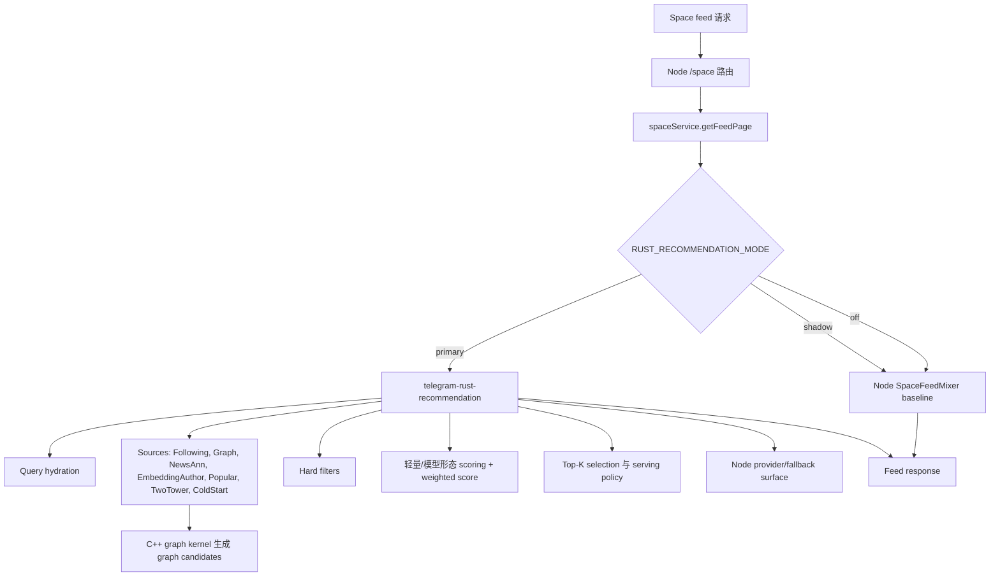
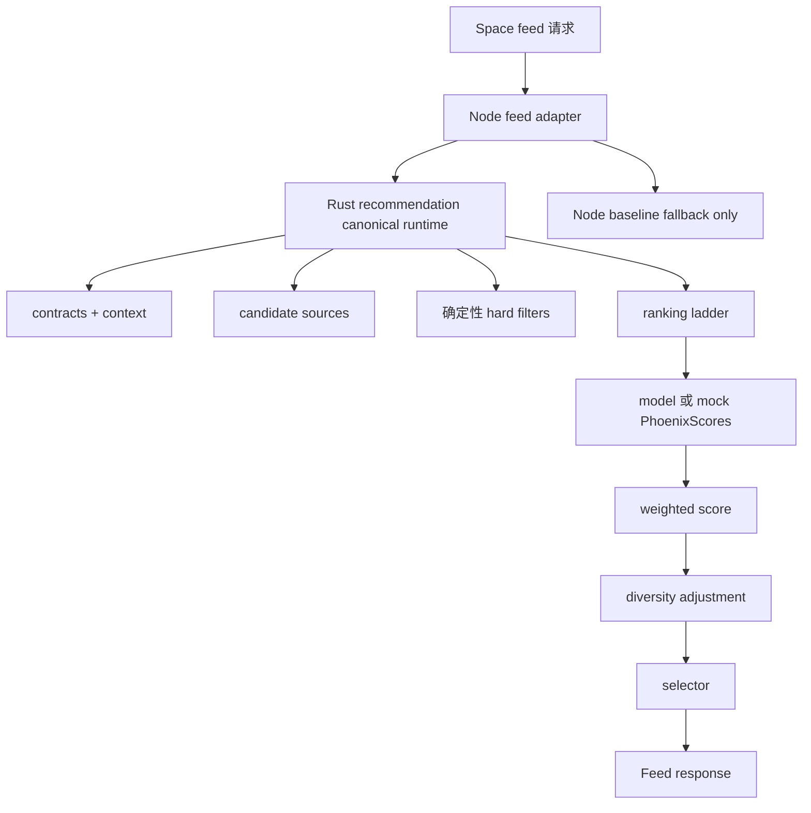

# 推荐算法路线图

状态：Phase 6 骨架建设进行中，2026-05-04

本文档是推荐算法与代码骨架工作的长期控制点。当前内容刻意限定在算法质量、代码质量与骨架升级，不覆盖运维、安全、监控或解释输出。

## 当前约束

当前阶段不要修改以下目录：

- `ml-services/**`
- `telegram-light-jobs/**`

这两个区域依赖 Google Cloud 模型产物、任务和平台配置。它们可以被阅读作为上下文，但在 GCP 相关阶段被明确打开之前，所有代码改动都必须位于这些目录之外。

当前阶段不覆盖：

- 运维
- 安全
- 监控
- 输出解释
- 线上发布机制
- GCP job 实现
- ML 服务重构

## Phase 0 外部复读

在写入这份基线之前，已通过 GitHub MCP 重新阅读以下仓库与文件：

`xai-org/x-algorithm`

- `README.md`
- `candidate-pipeline/candidate_pipeline.rs`
- `home-mixer/candidate_pipeline/phoenix_candidate_pipeline.rs`

带入本仓库的关键思想：

- 将 feed 算法保持为显式阶段序列：query hydration、source、hydration、filter、scorer、selection、post-selection、side effect。
- 将 in-network 与 out-of-network 候选 lane 作为一等 source，并保持稳定归因。
- 模型 action score 是排序主输入；weighted scoring 应组合模型输出，而不是变成隐藏的特征引擎。
- filter 必须是确定性的，并与 scoring 分离。

`ultraworkers/claw-code`

- `rust/Cargo.toml`
- `rust/MOCK_PARITY_HARNESS.md`

带入本仓库的关键思想：

- 使用一个 canonical runtime surface，避免多套实现并行增长。
- 当多个 Rust 服务开始共享长期行为时，优先使用 workspace 级结构和共享 contract。
- 在扩大实现复杂度之前，先建立固定场景的确定性 parity/replay harness。

每个后续阶段在标记完成之前，都必须重复对应 GitHub MCP 阅读。不能用之前的记忆替代阶段复读。

## 当前推荐路径

当前重要事实：

- `telegram-rust-recommendation` 已通过 `src/candidate_pipeline/definition.rs` 拥有 canonical recommendation pipeline definition。
- Node 仍通过 `SpaceFeedMixer` 保留完整 baseline recommendation pipeline。
- `spaceService.getFeedPage` 当前负责在 Node baseline、Rust shadow/primary 与 fallback 行为之间做选择。
- 当前 Rust 路径已经包含 sources、filters、scorers、selectors、serving policy 与 graph source orchestration。
- 当前面向模型的 Python 路径仍不属于本阶段，因为 `ml-services/**` 已冻结。

## 目标推荐路径

目标权责：

| 区域 | 长期 owner | 当前阶段规则 |
|---|---|---|
| Feed API adapter | Node | 只保留薄适配层 |
| 新推荐 source 逻辑 | Rust | 只加到 Rust |
| 新 filter 逻辑 | Rust | 只加到 Rust |
| 新 ranking/scoring 逻辑 | Rust | 只加到 Rust |
| Baseline fallback | Node | 保留但不扩张 |
| Model serving | Python ML | 冻结到 GCP 阶段 |
| Light jobs | Google Cloud jobs | 冻结到 GCP 阶段 |
| Graph candidate data plane | C++ graph kernel | 当前算法阶段只作为只读依赖 |

## 代码增长规则

未来推荐算法代码默认放置位置：

- Rust contracts：`telegram-rust-recommendation/src/contracts/`
- Rust query/context：`telegram-rust-recommendation/src/pipeline/` 或 `src/query_hydrators/`
- Rust source：`telegram-rust-recommendation/src/sources/`
- Rust filter：`telegram-rust-recommendation/src/filters/`，或在进一步拆分前暂放 `src/pipeline/local/filters.rs`
- Rust scorer/ranking：`telegram-rust-recommendation/src/scorers/` 或 `src/pipeline/local/scorers/`
- Rust selector：`telegram-rust-recommendation/src/selectors/`
- Rust replay/eval：`telegram-rust-recommendation/src/replay/` 或测试 fixture 模块

应该收缩或保持冻结的代码：

- `telegram-clone-backend/src/services/spaceService.ts`：保持为 feed adapter 与 fallback coordinator；不要增加新的算法分支。
- `telegram-clone-backend/src/services/recommendation/SpaceFeedMixer.ts`：保留为 baseline/fallback；不要加入新的长期策略。
- `telegram-clone-backend/src/services/recommendation/scorers/`：不要在这里增加新的长期 scorer。
- `ml-services/**`：当前阶段不改。
- `telegram-light-jobs/**`：当前阶段不改。

## 算法契约方向

在继续增加新 ranking 行为之前，必须收敛以下字段语义：

| 字段 | 契约方向 |
|---|---|
| `postId` | Node/Rust feed surface 使用的内部 post identity |
| `externalId` | ML/corpus identity；当前先记录语义，具体实现等待 ML/GCP 阶段 |
| `authorId` | 稳定作者 identity，用于 source attribution、重复作者惩罚和 candidate features |
| `source` / `recallSource` | 稳定 candidate source component name |
| `inNetwork` | candidate lane 属性，不是 scoring side effect |
| `seenIds` | 用户/session 排除输入 |
| `servedIds` | 最近已服务内容排除输入 |
| `userActionSequence` | 未来模型 scoring 使用的有序用户行为上下文 |
| `candidateFeatures` | ranking 消费的 candidate-side features；避免自由扩张 |
| `phoenixScores` | 多 action model 或 mock score 容器 |
| `weightedScore` | action scores 的加权组合 |
| `finalScore` / `score` | ranking adjustments 之后的 selector-facing score |

## 阶段关口

Phase 1 已在通过 GitHub MCP 重新阅读以下文件后开启：

- `xai-org/x-algorithm/home-mixer/candidate_pipeline/candidate.rs`
- `xai-org/x-algorithm/home-mixer/candidate_pipeline/query.rs`
- `xai-org/x-algorithm/home-mixer/scorers/weighted_scorer.rs`

Phase 1 的第一个本地产物是共享 fixture：`telegram-rust-recommendation/tests/fixtures/algorithm_contract_sample.json`，由 Rust 与 Node 测试共同解析。Node 与 Rust 也会将现有推荐边界 payload 投影到 canonical contract 中，因此 `postId`、`externalId`、`source`、`inNetwork`、`phoenixScores`、`weightedScore` 和 `finalScore` 已有共享的可执行锚点。

Phase 1 可执行锚点已在 2026-05-03 扩展：

- `provenance` 现在承载 primary source、retrieval lane、interest pool、secondary sources、selection pool 和 selection reason。
- `scoreMetadata` 现在承载 score contract 与 score breakdown version。
- `externalId` 仍是 canonical ML/corpus identity 占位语义：优先使用 news metadata external id，其次只在 `modelPostId` 不同于 `postId` 时使用它。
- 同一 fixture 同时由 `telegram-rust-recommendation` 与 `telegram-clone-backend` 校验。

Phase 2 已在通过 GitHub MCP 重新阅读以下文件后开启：

- `xai-org/x-algorithm/home-mixer/scorers/phoenix_scorer.rs`
- `xai-org/x-algorithm/home-mixer/scorers/weighted_scorer.rs`
- `xai-org/x-algorithm/home-mixer/scorers/author_diversity_scorer.rs`
- `xai-org/x-algorithm/home-mixer/selectors/top_k_score_selector.rs`

Phase 2 的第一个本地产物是 `telegram-rust-recommendation/src/pipeline/local/ranking/mod.rs` 中的 Rust local ranking ladder metadata 及其 scorer runner 集成。`LightweightPhoenixScorer` 被明确标记为 fallback model-score generation，`WeightedScorer` 拥有 weighted-score 创建权，规则阶段是 score adjustments，`AuthorDiversityScorer` 是正常的 final-score writer。`OutOfNetworkScorer` 已被移动到 final scoring 之前，并改为调整 `weightedScore`，而不是直接写 selector-facing `score`。

Phase 3 已在通过 GitHub MCP 重新阅读以下文件后开启：

- `xai-org/x-algorithm/home-mixer/server.rs`
- `xai-org/x-algorithm/home-mixer/main.rs`
- `xai-org/x-algorithm/home-mixer/candidate_pipeline/phoenix_candidate_pipeline.rs`
- `ultraworkers/claw-code/rust/README.md`
- `ultraworkers/claw-code/rust/Cargo.toml`

Phase 3 的第一个本地产物是 `telegram-clone-backend/src/services/recommendation/contracts/runtimeOwnership.ts`。它记录 Rust 是 canonical recommendation algorithm owner，Node 是 `legacy_baseline_fallback`。`SpaceFeedMixer` 现在显式暴露这个角色；它被保留用于迁移 fallback，而不是用于新增 source/scorer/ranking 能力。

Phase 4 已在通过 GitHub MCP 重新阅读以下文件后开启：

- `ultraworkers/claw-code/rust/MOCK_PARITY_HARNESS.md`
- `ultraworkers/claw-code/rust/mock_parity_scenarios.json`
- `ultraworkers/claw-code/rust/crates/rusty-claude-cli/tests/mock_parity_harness.rs`
- `xai-org/x-algorithm/candidate-pipeline/candidate_pipeline.rs`

Phase 4 的第一个本地产物是 `telegram-rust-recommendation/src/replay/` 中的 Rust replay 模块。它在不调用 Python、GCP 或 Node runtime 的前提下，评估 `telegram-rust-recommendation/tests/fixtures/` 下的确定性 replay fixtures。Replay harness 现在会先运行 local pre-score filters，再运行 local ranking 和 TopK selection，因此 fixtures 可以固定 hard-filter 行为，也可以固定 ranking 行为。`replay_warm_user.json` 当前覆盖 warm-user mock Phoenix scoring、cold-start fallback mix、negative author feedback suppression 和 news `externalId` duplicate filtering。`replay_user_state_matrix.json` 继续覆盖 sparse user source mix、heavy user repeated-author soft cap、in-network-only recency order，以及 duplicate/seen/served filter drop count。`replay_scenarios.json` 是场景 manifest；测试要求它与所有 fixture 的场景顺序保持一致，并为每个 case 记录 category、description 和 parity references。Expected-property contract 可以断言精确 selected IDs、min/max selection count、required filtered IDs、rank-before relationships、filter drop counts、selected source counts、repeated-author limits 和 selected-per-external-id limits。

Phase 5 已在通过 GitHub MCP 重新阅读以下文件后开启：

- `ultraworkers/claw-code/rust/Cargo.toml`
- `ultraworkers/claw-code/rust/crates/runtime/src/lib.rs`
- `ultraworkers/claw-code/rust/crates/tools/src/lib.rs`
- `ultraworkers/claw-code/rust/crates/rusty-claude-cli/src/main.rs`

Phase 5 的第一个本地产物是 `telegram-rust-workspace/`。它刻意是一个不影响构建的过渡目录，还不是 root Cargo workspace。当前仓库中 `telegram-rust-recommendation` 和 `telegram-rust-gateway` 各自拥有独立 `Cargo.lock`；直接创建 root workspace 会改变依赖解析和 lockfile 归属。因此，在进行更大迁移之前，先用 transition manifest 记录目标共享 crates 和迁移关口。

Phase 6 已在通过 GitHub MCP 重新阅读以下文件后开启：

- `xai-org/x-algorithm/home-mixer/candidate_pipeline/phoenix_candidate_pipeline.rs`
- `xai-org/x-algorithm/home-mixer/sources/thunder_source.rs`
- `xai-org/x-algorithm/home-mixer/sources/phoenix_source.rs`
- `xai-org/x-algorithm/home-mixer/scorers/weighted_scorer.rs`

Phase 6 的第一个本地产物是 `telegram-rust-recommendation/src/candidate_pipeline/definition.rs` 中的 algorithm-version anchor。Rust runtime 现在记录 `rust_recommendation_algorithm_v1`、`rust_only_new_algorithm_logic` growth policy 和 Node `legacy_baseline_fallback` 角色。Scorer manifest 现在由 provider scorers 加 Rust local ranking ladder 派生，因此 ops/readiness surface 会按照真实执行顺序包含 `LightweightPhoenixScorer`、trend scorers、`InterestDecayScorer`、`IntraRequestDiversityScorer` 和最终的 `ScoreContractScorer`。`OutOfNetworkScorer` 仍是 `AuthorDiversityScorer` 写入 final selector-facing `score` 之前的 score-adjustment stage。

Phase 6 在 2026-05-04 增加了第二个本地产物：`telegram-rust-recommendation/src/candidate_pipeline/manifest.rs` 的组件级 execution manifest。清单现在区分 provider 模型 scorer 与 Rust 本地算法阶段：`PhoenixScorer`、`EngagementScorer` 仍标记为 Rust 编排的 Node provider 调用；pre-score filters、Rust local scorer ladder、selector、post-selection filters 和 side effects 标记为 Rust 进程内执行。这使 ops/runtime surface 与真实执行路径一致，避免把已经收敛到 Rust 的算法阶段误判为 Node 可扩张区域。

Phase 6 在 2026-05-04 增加了第三个本地产物：source、ranking、selection 的版本锚点。`sourcePolicyMode` 继续记录 source budget policy，`rankingLadderVersion` 记录当前 Rust ranking ladder，`selectorPolicyVersion` 记录当前 Top-K selector policy。后续调整 source/filter/scorer/selector 时，必须先判断是否改变这些版本语义，再用 replay 固定行为变化。

Phase 6 在 2026-05-04 增加了第四个本地产物：WeightedScorer 权重策略锚点。`WeightedScorer` 现在通过 stage detail 暴露 `weightedScorerPolicyVersion`、normalization positive/negative weight sum 和 negative score offset；Phoenix/action/heuristic 权重被命名为本地常量，但不改变现有分数行为。后续调整 action weight 或 normalization 时，必须升级该 policy version，并用 replay 说明排序变化。

Phase 6 在 2026-05-04 增加了第五个本地产物：Node provider scorer allowlist。Rust 调用 Node `/score` 时，Node 只允许执行 `PhoenixScorer` 和 `EngagementScorer` 这类 provider scorer；`WeightedScorer` 等本地排序 scorer 只保留在 Node legacy baseline 内。这样可以防止 Rust 主路径把 ranking 权重和本地排序逻辑重新泄漏回 Node。

Phase 6 在 2026-05-04 增加了第六个本地产物：replay stage detail assertions。`replay_warm_user.json` 现在不仅固定 selected candidates，也固定 `DuplicateFilter` 的 Rust 本地执行模式、`WeightedScorer` 的 policy version、`AuthorDiversityScorer` 的 final-score writer 角色、`ScoreContractScorer` 的 metadata 角色，以及 `RustTopKSelector` 的 selector policy、audit 与 constraint version。后续调整 stage detail、score writer、scorer policy 或 selector policy 时，replay 会先暴露语义变化。

Phase 6A 在 2026-05-04 完成第一轮 replay 覆盖加厚。Replay expected contract 现在可以断言完整 `stageOrder`、`mustHaveStages`、`mustNotHaveStages`、单候选 `scoreRanges`、`rankingStageKinds`、`selectedLaneCounts` 和 `selectorDeferredReasonCounts`。这一步借鉴 `claw-code` mock parity harness 的场景清单思想，以及 `x-algorithm` pipeline 固定阶段思想；replay 不再只验证最终候选，而是把 filter、ranking ladder 和 selector 的关键语义一起固定下来。

Phase 6B 在 2026-05-04 完成 pipeline stage 顺序强约束。Rust local scorer runner 现在有测试固定 19 个 scorer 的真实执行顺序，并固定 weighted-score mutation 区间、唯一 final-score writer、fallback model scorer 与 metadata tail stage。这个约束对应 `x-algorithm` 的显式 scorer 装配方式，防止后续把新的 scorer 静默插入错误位置。

Phase 6C 在 2026-05-04 完成 source contract 的第一轮收敛。`normalize_source_candidates` 现在不只回填 `recallSource`，也会按 source registry 回填 `retrievalLane`，并在 `inNetwork` 缺失时从 lane 推导网络属性。Graph source、Node batch source 和 Node individual source 都共用这条归一化路径，因此 Following、Graph、Popular、TwoTower、EmbeddingAuthor、NewsAnn、ColdStart 的候选身份和 lane 语义不再由各 source 自由解释。

Phase 6D 在 2026-05-04 完成 ranking ladder 语义分层的第一步。每个 Rust local scorer stage 现在除了 `rankingStageKind`，还会暴露 `rankingScoreRole`：`model_score_generation`、`weighted_score_creation`、`weighted_score_adjustment`、`final_score_creation` 或 `metadata_only`。Replay fixture 已经固定 `WeightedScorer`、`AuthorDiversityScorer` 和 `ScoreContractScorer` 的 role，因此后续把“创建 weightedScore”和“调整 weightedScore”拆得更细时，会先通过 replay 暴露 contract 变化。

Phase 6E 在 2026-05-04 完成 selector policy 工业化的第一步。`select_candidates_with_report` 现在返回机器可读的 `SelectorPolicySnapshot`，包含 target size、window factor、lane floors/ceilings、lane order、OON/news/trend/exploration 限制，以及 author/topic/source/domain/media soft caps。Replay 的 `RustTopKSelector` stage detail 已开始固定这些 policy 数值，selector 不再只是“返回 Top-K”，而是能把选择策略作为稳定 contract 暴露出来。

Phase 6F 在 2026-05-04 完成 Node 职责进一步收缩的第一步。Node runtime ownership contract 现在显式区分 Rust `/score` 可调用的 provider scorers（`PhoenixScorer`、`EngagementScorer`）与 Node legacy baseline scorers（包含 `WeightedScorer`、`AuthorDiversityScorer`、`OONScorer` 等）。`componentCatalog` 使用同一个 ownership helper 判断 provider scorer，测试会拒绝 Rust provider 调用 `WeightedScorer`，防止 ranking 权重和 final-score 逻辑重新从 Rust 主路径泄漏回 Node。

Phase 6G 在 2026-05-04 完成 runtime surface 收敛的第一步。Rust `/ops/recommendation/summary` runtime 现在暴露 `algorithmContractVersion`、`sourceContractVersion`、`rankingScoreRoleVersion`、`selectorAuditVersion` 和 `selectorConstraintVersion`；runtime contract version 同步升级为 `recommendation_runtime_contract_v6`。这使外部 adapter、ops 页面和 replay 对照可以看到算法契约、source 契约、ranking role 与 selector 约束的版本，而不是只看到笼统的 pipeline version。

Phase 6H 在 2026-05-04 完成真实 Rust workspace 迁移准备。`telegram-rust-workspace/workspace-migration-readiness.md` 记录了当前两个 Rust 服务的独立 lockfile、`redis` 依赖版本偏差、第一批 shared crate 抽取顺序、迁移前验证项，以及不修改 `ml-services/**`、`telegram-light-jobs/**` 的约束。当前仍不创建 root Cargo workspace；下一步只有在接受 lockfile 归属变化后，才开始抽 `telegram-recommendation-contracts`。

Phase 7A 在 2026-05-04 完成 feed 默认 payload 收敛。`_recommendationExplain.signals` 和 `_scoreBreakdown` 不再默认进入公开 feed 响应；只有 `RECSYS_DEBUG_RESPONSE`、`RECSYS_DEBUG_SCORE_BREAKDOWN` 或 `RECSYS_EXPOSE_EXPLAIN_SIGNALS` 打开时才输出调试级字段。内部 trace 与 replay 仍保留完整信号，因此这一步只降低客户端默认载荷和响应耦合，不削弱算法诊断能力。

Phase 7B 在 2026-05-04 完成 Node 路由职责进一步压薄。`routes/space.ts` 不再直接维护推荐 trace、detail 和 feed candidate 响应拼装；这些逻辑迁入 `services/recommendation/adapters/spaceFeedResponseAdapter.ts`。路由只负责请求解析、调用 `spaceService`、传入 URL normalize 和调试开关，推荐响应 DTO 归 recommendation adapter 管理。

Phase 7C 在 2026-05-04 完成 Graph materializer cache 强化。Rust `GraphSourceRuntime` 增加进程内短 TTL materializer cache，cache key 对 author ids 做 trim、排序和去重，并纳入 limit/lookback。命中时可以避免重复请求 Node graph author provider；telemetry 会暴露 Rust cache key mode、TTL、entry count 和 eviction count。Rust serve cache 本阶段保持已有 `normalized_query_v2` 与 `bounded_short_ttl_v1` 语义。

Phase 7D 在 2026-05-04 完成 source batch 与 hydrator provider 边界收窄。Rust candidate hydrator 和 post-selection hydrator 现在即使没有 circuit breaker，也会显式传入 pipeline definition 中声明的组件列表，避免 Node provider 因默认执行全部组件而隐式扩大推荐路径。Source batch 继续按 Rust source order 显式请求。

Phase 7E 在 2026-05-04 完成 ranking ladder 契约增强。Rust 新增 `validate_ranking_ladder`，直接约束本地 ladder 必须以 model scores 开始、只有一个 weighted score stage、只有一个 final score writer、final score 之后只能 metadata，并且只能有一个 fallback model scorer。测试会直接校验 ladder spec，而不仅依赖执行结果间接暴露问题。

Phase 7F 在 2026-05-04 完成 selector score source 收敛。Top-K selector 的排序分数源收敛为候选 `score`，不再回退解释 `weighted_score` 或 `pipeline_score`；selector stage detail 增加 `selector_final_score_source_v1`。这一步让 selector 更接近 `x-algorithm` 的 TopK selector 形态：ranking 负责生成最终分数，selector 只消费最终分数和选择约束。

Phase 7G 在 2026-05-04 完成 Rust runtime surface 边界整理。运行时版本、模式、并发预算从 `candidate_pipeline/definition.rs` 抽到 `runtime/versions.rs`，definition 继续 re-export 以保持现有调用面稳定。`graphMaterializerCacheMode` 同步更新为 `rust_short_ttl_with_node_provider_cache_v1`，反映 Rust materializer cache 与 Node provider cache 的组合形态。

Phase 7H 在 2026-05-04 完成 VPS readiness 版本源头收敛。`deploy/vps/check_recommendation_readiness.sh` 不再把 runtime 期望值直接写死在 Python 判断里，而是读取 `deploy/vps/recommendation_runtime_contract.env`。后续修改 pipeline、runtime contract、cache mode、serving mode 或 side effect mode 时，需要同步 Rust `runtime/versions.rs` 和该 env 契约文件。

Phase 8A 在 2026-05-04 完成 Node feed 推荐编排入口的第二轮拆薄。`spaceService.ts` 中 Rust primary/shadow 分支下沉到 `services/recommendation/feed/rustFeedRuntime.ts`，feed debug 信息构建下沉到 `services/recommendation/feed/debugInfo.ts`。`SpaceService` 仍保留业务 fallback、in-network direct fallback、自帖子合并和 trace 调用，但不再直接持有 Rust recommendation client、contract serializer、shadow comparison 和 runtime metrics 细节。

Phase 8B 在 2026-05-04 完成 selector score source 的 runtime/readiness 契约输出。Rust ops runtime 新增 `selectorScoreSourceVersion`，VPS readiness 新增 `EXPECTED_RECOMMENDATION_SELECTOR_SCORE_SOURCE_VERSION` 校验。该字段固定当前 selector 只消费 final `score` 的语义，避免后续悄悄回退到 `weighted_score` 或 `pipeline_score`。

Phase 8C 在 2026-05-04 完成 Graph materializer cache ops summary 补齐。Ops summary 现在额外暴露 `lastGraphMaterializerRequestedAuthorCount`、`lastGraphMaterializerUniqueAuthorCount` 和 `lastGraphMaterializerReturnedPostCount`，VPS readiness 输出也同步包含这些字段。这样可以判断 materializer cache 命中/未命中时实际 author 请求规模和返回量，而不是只看 cache hit 与 latency。

Phase 8D 在 2026-05-04 增加 feed response adapter 的确定性断言。`spaceFeedResponseAdapter.test.ts` 固定默认响应不会输出 heavy signals、score breakdown、pipeline score 和 recommendation trace；只有 debug/explain 开关开启时才输出这些字段。该测试保护 Phase 7A 的 payload 收敛语义，不追求泛覆盖率。

### Phase 1 关口：算法契约

完成前必须：

- 通过 GitHub MCP 重新阅读：
  - `xai-org/x-algorithm/home-mixer/candidate_pipeline/candidate.rs`
  - `xai-org/x-algorithm/home-mixer/candidate_pipeline/query.rs`
  - `xai-org/x-algorithm/home-mixer/scorers/weighted_scorer.rs`
- 在 `ml-services/**` 之外添加或更新本地 contract fixtures。
- 证明 Node 与 Rust 对同一批 contract 字段的理解一致。

### Phase 2 关口：Rust 主骨架

完成前必须：

- 通过 GitHub MCP 重新阅读：
  - `xai-org/x-algorithm/home-mixer/scorers/phoenix_scorer.rs`
  - `xai-org/x-algorithm/home-mixer/scorers/weighted_scorer.rs`
  - `xai-org/x-algorithm/home-mixer/scorers/author_diversity_scorer.rs`
  - `xai-org/x-algorithm/home-mixer/selectors/top_k_score_selector.rs`
- 证明 Rust source/filter/ranking/selection 边界是显式的。
- 证明 mock `PhoenixScores` 可以驱动完整 ranking ladder。

### Phase 3 关口：Node 职责收缩

完成前必须：

- 通过 GitHub MCP 重新阅读：
  - `xai-org/x-algorithm/home-mixer/server.rs`
  - `xai-org/x-algorithm/home-mixer/main.rs`
  - `xai-org/x-algorithm/home-mixer/candidate_pipeline/phoenix_candidate_pipeline.rs`
  - `ultraworkers/claw-code/rust/README.md`
  - `ultraworkers/claw-code/rust/Cargo.toml`
- 保持 Node 作为 adapter/fallback；不要把新的算法行为放入 Node。

### Phase 4 关口：Replay/Eval 骨架

完成前必须：

- 通过 GitHub MCP 重新阅读：
  - `ultraworkers/claw-code/rust/MOCK_PARITY_HARNESS.md`
  - `ultraworkers/claw-code/rust/mock_parity_scenarios.json`
  - `ultraworkers/claw-code/rust/crates/rusty-claude-cli/tests/mock_parity_harness.rs`
  - `xai-org/x-algorithm/candidate-pipeline/candidate_pipeline.rs`
- 添加不调用 `ml-services` 的确定性 replay fixtures。
- 校验 ranking、filters、source merge、repeated author behavior 和 negative-action suppression。

### Phase 5 关口：Rust Workspace/共享骨架

完成前必须：

- 通过 GitHub MCP 重新阅读：
  - `ultraworkers/claw-code/rust/Cargo.toml`
  - `ultraworkers/claw-code/rust/crates/runtime/src/lib.rs`
  - `ultraworkers/claw-code/rust/crates/tools/src/lib.rs`
  - `ultraworkers/claw-code/rust/crates/rusty-claude-cli/src/main.rs`
- 决定是否创建单一 Rust workspace，或继续使用显式 transitional shared-contract layout。

### Phase 6 关口：Rust 算法中心

完成前必须：

- 通过 GitHub MCP 重新阅读：
  - `xai-org/x-algorithm/home-mixer/candidate_pipeline/phoenix_candidate_pipeline.rs`
  - `xai-org/x-algorithm/home-mixer/sources/thunder_source.rs`
  - `xai-org/x-algorithm/home-mixer/sources/phoenix_source.rs`
  - `xai-org/x-algorithm/home-mixer/scorers/weighted_scorer.rs`
- 确保每一个新的 algorithm source/filter/scorer/selector 都进入 Rust。

## Phase 0 验收

Phase 0 完成条件：

- 本路线图存在，并已从 root README 链接。
- 当前阶段冻结目录已显式记录。
- 当前推荐路径和目标推荐路径已记录。
- 新算法代码默认进入 Rust 的规则已写明。
- 后续阶段的外部 GitHub MCP 复读要求已记录。
