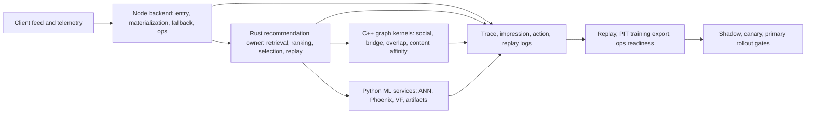

# 2026-07-07 Recommendation Algorithm Research Design

## Superpowers Workflow Status

- Skill used: `superpowers:dispatching-parallel-agents`.
- Skill used: `superpowers:brainstorming`.
- Skill used for next step: `superpowers:writing-plans`, after this design is approved.
- Research access skill used by external agents: `agent-reach`.
- Agent requirement: request `5.6-sol` with `ultra` reasoning when the orchestration surface exposes selectors. The current interface did not expose those selectors, so no exact agent model configuration is claimed here.

This document began as the design checkpoint before the task-by-task implementation plan. It is not an implementation diff; the status section below records the later Phase 0 result.

## Phase 0 Implementation Status

On 2026-07-12, the two local fail-open defects described below were repaired and independently reviewed:

- Ops readiness now blocks missing, partial, invalid, or incompatible replay/embedding evidence.
- Strict embedding audit now has deterministic tests, validates both required user vectors and the expected heuristic post contract, and runs inside the full release script.

Fresh local verification passed 22/22 readiness tests, 9/9 audit tests, TypeScript checks, shell syntax, C++ release/ASan, Go, performance, and 10/10 Rust replay tests. Full `verify_all` still exits 1 at the strict live audit because all 646 sampled user documents and all 1,917 sampled post snapshots are incompatible with the currently required contracts.

Therefore the gate implementation is fail-closed, but Phase 0 release verification, canary readiness, and production readiness are not achieved. Live ops credentials are unavailable and four deployment checker scripts are also missing.

## Feasibility Verdict

The project idea is feasible. The current codebase already has the shape of a modern feed recommender: multi-source recall, graph retrieval, embedding and ANN hooks, ranking/scoring, filters, diversity, replay, trace, and staged Rust rollout with Node fallback.

The main blocker is not the algorithm direction. The remaining blockers are production evidence quality: live embedding-contract incompatibility, cross-runtime contract drift, incomplete point-in-time features, incomplete exposure and candidate logging, incomplete deployment gates, and duplicate algorithm ownership across Node, Rust, Python, and C++.

The correct next stage is to make the existing architecture replayable, versioned, and observable before adding heavier models.

For the current implementation round, Python is a read-only dependency surface. Do not edit `ml-services/**`, Python tests, or Python endpoint implementations; any Python drift is documented for later work and is not repaired by this plan.

## Current Architecture Reading

### Node and TypeScript

Node currently acts as product entrypoint, legacy feed baseline, adapter layer, materializer, fallback owner, and ops control plane.

Important code paths:

- `telegram-clone-backend/src/services/spaceService.ts:701`: feed entry constructs `FeedQuery` and resolves runtime mode.
- `telegram-clone-backend/src/services/recommendation/feed/rustFeedRuntime.ts:52`: Rust primary failure falls back to Node baseline.
- `telegram-clone-backend/src/services/recommendation/internal/componentCatalog.ts:132`: source catalog includes following, graph, news ANN, embedding author, popular, two-tower, and cold-start sources.
- `telegram-clone-backend/src/services/recommendation/sources/GraphSource.ts:291`: graph source calls C++ graph kernels and materializes posts.
- `telegram-clone-backend/src/services/recommendation/sources/TwoTowerSource.ts:65`: two-tower source is still experiment-gated.
- `telegram-clone-backend/src/services/recommendation/selectors/TopKSelector.ts:65`: top-k selector owns lane limits, exploration floor, and author/topic/source caps.
- `telegram-clone-backend/src/services/recommendation/observability/recommendationTrace.ts:74`: trace supports Rust trace and replay pool.
- `telegram-clone-backend/src/services/recommendation/replay/evaluator.ts:55`: replay evaluator already computes ranking and logging-readiness metrics.

Key Node risk: `SpaceFeedMixer` does not fully use the stronger adapter-service path for dependency-aware hydration, source evidence merge, stage detail, and replay pool.

### Rust

Rust is the right durable owner for the feed algorithm.

Important code paths:

- `telegram-rust-workspace/crates/telegram-rust-recommendation/src/server/app.rs:52`: recommendation server routes and readiness.
- `telegram-rust-workspace/crates/telegram-rust-recommendation/src/pipeline/executor/mod.rs:133`: main staged pipeline.
- `telegram-rust-workspace/crates/telegram-rust-recommendation/src/replay/tests.rs:43`: replay scenarios and contract checks.
- `telegram-rust-workspace/crates/telegram-recommendation-contracts/src/contracts/query.rs:206`: Rust feed query contract.

Rust already matches the intended ownership boundary: candidate construction, retrieval orchestration, ranking, selection, serving, and replay.

### C++ Graph Kernel

C++ is a good fit for low-latency graph kernels.

Important code paths:

- `telegram-cpp-graph-service/src/http/routes/graph_routes.cpp:243`: social, recent, co-engager, content affinity, bridge, and overlap routes.
- `telegram-cpp-graph-service/src/http/routes/graph_routes.cpp:88`: diagnostics include kernel, duration, candidates, snapshot version, pruning, frontier, budget, and empty reason.
- `telegram-cpp-graph-service/src/graph/graph_store.cpp:102`: snapshot publish and rollback.

Key C++ risk: snapshot pagination is not pinned consistently across pages. The Node provider has snapshot version and keyset cursor support, but the C++ client still relies mainly on offset/limit.

### Python ML Services

Python should become the model inference and artifact service, not the long-term feed owner.

Important code paths:

- `ml-services/app.py:1059`: `/ann/retrieve`.
- `ml-services/app.py:1121`: `/phoenix/predict`.
- `ml-services/app.py:1352`: `/feed/recommend`.

The `/ann/retrieve`, `/phoenix/predict`, and VF-style model endpoints are useful service boundaries. The Python `/feed/recommend` endpoint duplicates ANN, Phoenix, VF, Mongo mapping, fallback, dedupe, and weighted scoring in one endpoint, so it should be kept as shadow or diagnostic during migration.

## Findings From Parallel Agents

### Local Code Review Agents

1. Node/TS review:
   - The system has real multi-source, graph, embedding, replay, and ops skeletons.
   - Node is still a legacy baseline plus adapter migration layer.
   - `Pipeline.hydrateQuery` runs enable checks before dependency-producing hydrators merge their patches, which can skip dependent hydrators.
   - Source evidence merge exists in `candidateMerge.ts`, but the `SpaceFeedMixer` framework path flattens source batches and loses secondary source evidence.
   - Stage detail and bounded Node replay pool do not enter the local online trace.

2. Rust/C++/Python review:
   - Rust should be canonical feed algorithm owner.
   - Node should remain entrypoint, adapter, materializer, fallback, and control plane.
   - C++ should remain graph kernel owner.
   - Python should own ML endpoints and artifacts, not full feed orchestration.
   - Cross-language drift already exists: weighted scorer uses different follow-author weights in Rust versus Node/Python.

3. Data, logging, replay, and ops review:
   - The system can continue offline and shadow validation; canary or production iteration is not established without live ops evidence, a passing strict audit, and complete deployment checkers.
   - It should not yet claim paper-grade OPE, online learning, or fully automated rollout.
   - Baseline finding, now repaired locally: `buildRecommendationOps` read readiness fields that `traceSummary` did not produce.
   - Baseline finding, now repaired locally: embedding audit printed JSON but did not fail release checks on incompatible samples.
   - training export is not point-in-time and can leak current features into historical samples.

### External Research Agents

1. Industry-practice research:
   - X/Twitter Product Mixer, Home Mixer, CR-Mixer, GraphJet, RealGraph, SimClusters, and TwHIN all support the staged architecture direction.
   - YouTube and Instagram support the two-stage recall-plus-ranking direction.
   - Pinterest Pixie and lightweight ranking support graph recall plus cheap pre-ranking before heavy models.

2. Literature research:
   - Now: YouTube two-stage DNN, FAISS ANN evaluation, GraphJet-style real-time graph, WTF/RealGraph-style affinity, personalized reranking metrics, Open Bandit style propensity logging, and point-in-time feature store practices.
   - Next: sampling-bias correction for two-tower training, SimClusters-lite, LightGCN baseline, Deep Interest Network-style behavior sequence features.
   - Later: TwHIN, PinSage, GraphSAGE, full GNN production path, DLRM or heavy multi-task ranker.

3. Open-source ecosystem research:
   - `twitter/the-algorithm` should be borrowed for design only because of AGPL-3.0.
   - GraphJet concepts can inform the C++ graph kernel.
   - Feast should be borrowed first as a point-in-time feature contract, not imported as a platform yet.
   - FAISS or hnswlib can support ANN experiments.
   - RePlay and RecBole can inform offline evaluation patterns without entering the serving path.

## Three Integration Approaches

### Approach A: Minimal Production Hardening

Fix the release gates, logging, replay, and cross-runtime contract drift while keeping current runtime ownership mostly unchanged.

Pros:

- Lowest implementation risk.
- Directly fixes current P1 readiness issues.
- Improves local preconditions for Rust shadow evaluation, but does not establish canary or production readiness without live ops evidence.

Cons:

- Leaves duplicate feed logic in Node/Python for longer.
- Does not yet clarify long-term algorithm ownership enough.

### Approach B: Rust-Canonical Industrialization

Make Rust the canonical feed algorithm owner, keep Node as entrypoint and fallback, keep C++ as graph kernel, and reduce Python to model endpoints. First stabilize contracts and telemetry, then move stage evidence and replay into Rust-owned canonical flow.

Pros:

- Best match for current code direction and runtime ownership contract.
- Reduces duplicate algorithm behavior.
- Aligns with Product Mixer style staged pipelines.
- Gives a clear path to ANN, graph recall, and ranker evolution.

Cons:

- Requires careful cross-language fixture and rollout work.
- Needs disciplined boundaries so Node fallback remains safe but does not keep growing.

### Approach C: ML-First Rebuild

Push aggressively toward full two-tower plus ANN plus heavy ranker, then use replay and ops gates afterward.

Pros:

- Looks attractive from a model roadmap perspective.
- Could produce quick offline experiments.

Cons:

- High risk of training leakage because point-in-time data is not ready.
- OPE is not possible without propensity and exploration logs.
- Existing graph and Rust pipeline investments would be underused.
- It would likely produce impressive offline numbers without reliable online evidence.

### Recommendation

Choose Approach B, with Approach A as the first milestone. Do not choose Approach C yet.

The immediate implementation plan should first close production evidence gaps, then consolidate canonical ownership, then introduce stronger models only when replay and feature contracts can prove their value.

## Target Architecture

Runtime boundaries:

- Node:
  - Own product-facing API.
  - Own materialization and response adaptation.
  - Own legacy fallback and control plane.
  - Must not keep adding new algorithm behavior except to preserve fallback parity.

- Rust:
  - Own canonical candidate pipeline.
  - Own source orchestration, merge, scoring, filtering, selection, serving, and replay fingerprint.
  - Own canonical stage contracts and stage telemetry.

- C++:
  - Own graph data structures and low-latency traversal kernels.
  - Return stable diagnostics, snapshot version, budget status, and empty reason.

- Python:
  - Own model inference endpoints and artifact readiness.
  - Keep `/feed/recommend` only as shadow, diagnostic, or transitional endpoint until removed.

- Data and ops:
  - Own point-in-time training exports, exposure logs, replay metrics, and release gates.

## Priority Risks

### P1: Ops Readiness Could Fail Open - Repaired Locally

Baseline defect: `buildRecommendationOps` read `traceSummary.replayLoggingReadiness` and `traceSummary.embeddingContractIncompatibleCount`, but `traceSummary` did not produce those fields. The Phase 0 patch now emits replay readiness, preserves missing embedding evidence as `null`, and blocks missing, partial, invalid, or incompatible inputs.

Files:

- `telegram-clone-backend/src/services/ops/recommendation/buildRecommendationOps.ts:99`
- `telegram-clone-backend/src/services/recommendation/ops/traceSummary.ts:100`

Required design response:

- Wire replay logging readiness from replay evaluator or trace summary.
- Wire embedding contract incompatible counts from source stage detail or degraded reasons.
- Treat missing required readiness evidence as a blocker, not as success.
- Do not infer `embeddingContractIncompatibleCount = 0` from the absence of degraded reasons. Missing contract telemetry is missing evidence.
- Require `totalRequests` and all five replay missing-field counters as finite, non-negative integers; partial readiness payloads must block before normalization.
- Treat the six counters as a minimum diagnostic joinability contract, not as proof of propensity-based OPE or end-to-end logging completeness.

### P1: Embedding Audit Did Not Block - Repaired Locally

Baseline defect: the embedding contract audit printed JSON but did not exit nonzero when incompatible vectors were found. The Phase 0 patch now preserves JSON output and exits nonzero for missing required evidence or incompatible sampled contracts. The live audit currently blocks all sampled user and post records, so release verification remains non-passing.

Files:

- `telegram-clone-backend/src/scripts/auditEmbeddingContracts.ts:47`
- `tools/release/verify_all.sh:9`

Required design response:

- Add strict mode or default nonzero exit on incompatible sampled vectors, non-empty vectors missing contracts, and zero required user/post samples.
- Keep JSON output for ops dashboards.
- Limit the claim to sampled contract presence and vector dimensional consistency. It does not prove semantic space identity, normalization, index mapping, or ANN quality.

### P1: Training Samples Are Not Point-In-Time

Historical training samples can use current user embeddings, current/backfilled post snapshots, and current-window user state.

Files:

- `telegram-clone-backend/src/scripts/exportRecsysTrainingSamples.ts:276`
- `telegram-clone-backend/src/scripts/exportRecsysTrainingSamples.ts:310`
- `telegram-clone-backend/src/services/recommendation/contentFeatures/PostFeatureSnapshotService.ts:405`

Required design response:

- Add event timestamp, feature snapshot timestamp, feature version, model version, index version, and snapshot version to samples.
- Fail or quarantine samples when a point-in-time feature cannot be reconstructed.

### P1: Node Main Path Loses Source Evidence

Source evidence merge exists, but the main framework path flattens results and duplicate filtering can discard cross-source evidence.

Files:

- `telegram-clone-backend/src/services/recommendation/framework/Pipeline.ts:578`
- `telegram-clone-backend/src/services/recommendation/internal/merge/candidateMerge.ts:16`
- `telegram-clone-backend/src/services/recommendation/filters/DuplicateFilter.ts:17`

Required design response:

- Use source-batch merge before duplicate filtering.
- Preserve primary source, secondary sources, recall evidence, source confidence, and light-rank score in trace and replay.

### P1: Query Hydration Dependency Order Is Unsafe

The main Node pipeline runs hydrator enable checks before dependency-producing hydrators merge their patches.

Files:

- `telegram-clone-backend/src/services/recommendation/framework/Pipeline.ts:547`
- `telegram-clone-backend/src/services/recommendation/types/FeedQuery.ts:237`
- `telegram-clone-backend/src/services/recommendation/hydrators/query/UserStateQueryHydrator.ts:12`
- `telegram-clone-backend/src/services/recommendation/hydrators/MutualFollowQueryHydrator.ts:13`
- `telegram-clone-backend/src/services/recommendation/internal/adapterService.ts:272`

Required design response:

- Either move the main path to the dependency-aware adapter-service hydration flow, or add explicit staged hydration groups to the framework pipeline.

### P2: Cross-Language Scorer Drift Exists

Weighted scorer constants differ across Rust, Node, and Python.

Files:

- `telegram-rust-workspace/crates/telegram-ranking-primitives/src/weighted.rs:24`
- `telegram-clone-backend/src/services/recommendation/scorers/WeightedScorer.ts:31`
- `ml-services/app.py:1300`

Required design response:

- Add a small golden fixture suite for weighted scorer inputs and outputs across Rust, Node, and replay logs where the later gated plan confirms it is needed.
- Keep Python values as read-only comparison evidence; do not modify Python code or tests in the current round.
- After fixture coverage exists, mark Node formulas as fallback or shadow if Rust remains canonical.

### P2: C++ Snapshot Pagination Can Mix Versions

Node supports snapshot version and keyset pagination, but C++ client and loader still depend on offset pagination.

Files:

- `telegram-clone-backend/src/services/graphKernel/snapshotService.ts:190`
- `telegram-clone-backend/src/services/graphKernel/snapshotService.ts:243`
- `telegram-cpp-graph-service/src/snapshot/backend_snapshot_client.cpp:40`
- `telegram-cpp-graph-service/src/snapshot/snapshot_loader.cpp:41`

Required design response:

- Pin snapshot version after the first page.
- Prefer `nextCursor`.
- Keep `nextOffset` only as backward-compatible fallback.

### P2: ANN and Embedding Path Is Still Fallback-Oriented

News ANN and TwoTower have sensible gates, but ops must distinguish real ANN success from recency fallback.

Files:

- `telegram-clone-backend/src/services/recommendation/sources/NewsAnnSource.ts:51`
- `telegram-clone-backend/src/services/recommendation/sources/NewsAnnSource.ts:149`
- `telegram-clone-backend/src/services/recommendation/sources/TwoTowerSource.ts:65`
- `telegram-clone-backend/src/services/recommendation/sources/TwoTowerSource.ts:318`

Required design response:

- Track ANN hit, contract mismatch, index coverage, fallback recency, model version, index version, embedding space, and dimension.

## Industry and Literature Mapping

### Integrate Now

- Product Mixer and Home Mixer style stage boundaries.
- CR-Mixer style source orchestration and source evidence.
- GraphJet and Pixie style graph recall diagnostics, traversal budget, seed weighting, recency window, and popularity caps.
- RealGraph-style author/user affinity as features, not as a replacement ranker.
- YouTube two-stage candidate generation plus ranking.
- FAISS-style ANN evaluation: recall@K, exact-vs-ANN comparison, latency, and index version slices.
- Open Bandit style propensity and exploration logging.
- Feature-store point-in-time retrieval concepts: entity id, event timestamp, feature timestamp, feature version, and ASOF join behavior.

### Integrate Next

- Sampling-bias correction for two-tower training after exposure and item-frequency logs exist.
- SimClusters-lite sparse community or topic vectors.
- LightGCN as a simple graph collaborative-filtering baseline before heavier GNNs.
- Deep Interest Network style behavior sequence features after action sequence labels stabilize.
- Lightweight ranker or LambdaMART-style ranker with explainable features and score breakdown.

### Delay

- Full TwHIN.
- PinSage or GraphSAGE production path.
- DLRM or heavy multi-task ranker.
- Feast as a full platform dependency.
- DiskANN or Vespa as serving infrastructure.
- Online learning, slate RL, or automated rollout based on OPE.

## Next Implementation Plan Scope

The next Superpowers `writing-plans` document should be one focused plan, not a broad rewrite. It should implement the following milestones in order:

1. Close release-gate holes.
   - Make replay logging readiness and embedding incompatibility real blocker inputs.
   - Make embedding audit fail release verification on missing required samples/contracts or incompatible sampled contracts; do not claim enabled-source coverage unless a later plan implements it.

2. Stabilize cross-runtime contracts.
   - Add golden fixtures for feed query, candidate, graph diagnostics, weighted score, and replay result.
   - Compare Rust, Node, and C++ outputs where applicable; record Python observations as read-only dependency evidence only.

3. Fix Node main-path evidence loss.
   - Use dependency-aware hydration or staged hydration groups.
   - Merge source batches before duplicate filtering.
   - Write source stage detail and bounded replay pool into trace.

4. Make training exports point-in-time.
   - Add event timestamp, feature timestamp, feature version, model version, index version, embedding space, and graph snapshot version.
   - Quarantine samples with unknown provenance.

5. Pin graph snapshots and improve graph diagnostics.
   - Use snapshot version and keyset cursor in the C++ snapshot loader.
   - Add budget exhausted, degree cap, popularity cap, seed weight, recency window, and empty reason to replayable diagnostics where missing.

6. Make ANN evaluation real.
   - Add held-out positives, exact search comparison, recall@K, latency, and index-version slicing.
   - Keep ANN as sidecar or shadow until evidence passes gates.

7. Consolidate runtime ownership.
   - Declare Rust canonical for algorithm behavior in docs and gates.
   - Keep Node fallback parity but freeze new Node algorithm growth.
   - Describe Python `/feed/recommend` as shadow/diagnostic and retain existing model endpoint boundaries through documentation or non-Python configuration only.

## Success Criteria

- Every served item can be joined by `requestId + rank + postId` to recall source, score, selection pool, selection reason, experiment key, source evidence, model/index version, and later behavior labels.
- Replay readiness reports no missing required fields on sampled requests; this proves the current minimum diagnostic joinability fields only, not OPE readiness.
- Embedding contract audit hard-fails incompatible dimensions, non-empty vectors missing contracts, and zero required samples; passing proves sampled structural evidence only.
- Training export can state whether each feature is point-in-time valid.
- Rust, Node, and C++ agree on golden contract fixtures for the selected surfaces; Python remains read-only evidence in this round.
- C++ graph snapshot load is version-pinned across pages.
- ANN success and ANN fallback are distinguishable in ops and replay.
- Rust primary promotion requires trace, fallback, latency, graph diagnostics, replay logging, and embedding contract evidence.
- Local Phase 0 checks do not establish canary or production readiness without live ops credentials and complete deployment checker scripts.

## Non-Goals For The Next Plan

- Do not implement full TwHIN.
- Do not implement PinSage, GraphSAGE, or a production GNN.
- Do not introduce DLRM or a heavy multi-task ranker.
- Do not import Feast, Vespa, DiskANN, RePlay, or RecBole into serving.
- Do not remove Node fallback.
- Do not make Python `/feed/recommend` the canonical feed owner.

## External Sources Used

- X algorithm: https://github.com/twitter/the-algorithm
- GraphJet: https://github.com/twitter/GraphJet
- GraphJet paper: https://www.vldb.org/pvldb/vol9/p1281-sharma.pdf
- YouTube DNN recommendations: https://research.google/pubs/deep-neural-networks-for-youtube-recommendations/
- Sampling-bias-corrected neural modeling: https://research.google/pubs/sampling-bias-corrected-neural-modeling-for-large-corpus-item-recommendations/
- FAISS paper: https://arxiv.org/abs/1702.08734
- SimClusters: https://www.kdd.org/kdd2020/accepted-papers/view/simclusters-community-based-representations-for-heterogeneous-recommendatio
- TwHIN: https://ahelk.github.io/papers/twhin_kdd.pdf
- PinSage: https://www.kdd.org/kdd2018/accepted-papers/view/graph-convolutional-neural-networks-for-web-scale-recommender-systems
- LightGCN: http://staff.ustc.edu.cn/~hexn/papers/sigir20-LightGCN.pdf
- Deep Interest Network: https://arxiv.org/abs/1706.06978
- Personalized reranking: https://arxiv.org/abs/1904.06813
- Open Bandit Dataset and Pipeline: https://datasets-benchmarks-proceedings.neurips.cc/paper_files/paper/2021/file/33e75ff09dd601bbe69f351039152189-Paper-round2.pdf
- Prometheus `absent()`: https://prometheus.io/docs/prometheus/latest/querying/functions/#absent
- FAISS dimensionality and metric semantics: https://faiss.ai/index.html
- FAISS distribution caveat: https://github.com/facebookresearch/faiss/wiki/FAQ
- FAISS cosine normalization: https://github.com/facebookresearch/faiss/wiki/MetricType-and-distances
- Feature-store PIT practice: https://www.vldb.org/pvldb/vol16/p4230-camacho-rodriguez.pdf
- Feast: https://github.com/feast-dev/feast
- hnswlib: https://github.com/nmslib/hnswlib
- RePlay: https://github.com/sb-ai-lab/RePlay
- RecBole: https://github.com/RUCAIBox/RecBole

## Approval Gate

Approve this design before generating the detailed task-by-task implementation plan. The next plan should be saved as:

`docs/superpowers/plans/2026-07-07-recommendation-next-stage-industrialization.md`
